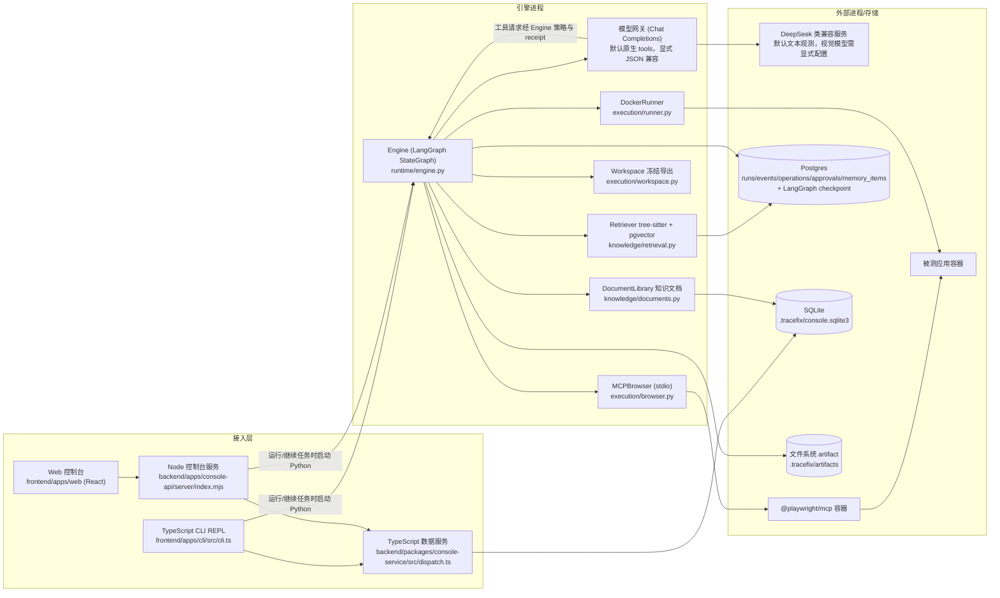

# 总体架构

## 1. 设计原则（现状已贯彻，目标架构继续保持）

| 原则 | 含义 | 现状证据 |
|---|---|---|
| 模型只提议，运行时执行 | 模型提出受限工具调用或类型化 JSON；网关校验参数，运行时校验策略并执行，状态变更仍由运行时完成 | `model/gateway.py:Gateway.browser_action`、`runtime/engine.py:Engine.act` |
| 确定性门禁 | 修复是否成功由外部断言 + 六类验证决定，不由模型自报 | `contracts.py:278-289` |
| 证据可追溯 | 模型 I/O、截图、diff、验证结果均以 SHA256 命名的 artifact 存储 | `storage/artifacts.py:98-145` |
| 副作用幂等 | 浏览器操作走 intent-hash + receipt；已完成工具调用复用结果，结果未知时转人工核查 | `runtime/engine.py:Engine.operation`、`model/gateway.py:Gateway.generate` |
| 最小权限 | 容器 cap-drop、internal 网络、只读根文件系统、路径白名单 | `execution/runner.py:50-59,94-102`、`execution/workspace.py:93-105` |
| 不可信输入隔离 | 网页、源码、记忆、知识文档都视为数据而非指令 | `knowledge/context.py:6-12`、`model/prompts.py:7` |

## 2. 现状组件图



## 3. 现状模块职责

| 模块 | 路径 | 职责 | 规模 |
|---|---|---|---|
| 运行引擎 | `backend/packages/agent/src/tracefix/runtime/engine.py` | 12 节点状态图、工具执行与观测更新、幂等操作、审计及安全恢复 | 见 `Engine` |
| 数据契约 | `backend/packages/agent/src/tracefix/runtime/contracts.py` | Phase / RunState / TestSpec / PatchProposal / 门禁 | 289 行 |
| 续跑 | `backend/packages/agent/src/tracefix/runtime/continuation.py` | 非成功 Run 的继续执行状态构造 | 32 行 |
| 只读子任务 | `backend/packages/agent/src/tracefix/runtime/worker.py` | DIAGNOSE 阶段只读委派 | 62 行 |
| 模型网关 | `backend/packages/agent/src/tracefix/model/gateway.py` | DeepSeek 类 Chat Completions；默认原生浏览器工具；显式 JSON 模式；有界重试、消息配对和用量计量 | 见 `Gateway` |
| 浏览器 | `backend/packages/agent/src/tracefix/execution/browser.py` | MCP client、动作翻译、断言、断线分类 | 409 行 |
| 沙箱 | `backend/packages/agent/src/tracefix/execution/runner.py` | docker run/exec、健康检查、浏览器容器命令 | 102 行 |
| 工作区 | `backend/packages/agent/src/tracefix/execution/workspace.py` | 权限过滤导出、补丁原子应用、本地分支 | 189 行 |
| 远程仓库 | `backend/packages/agent/src/tracefix/remote.py` | 仓库地址校验（只接受 github.com，与托管平台一致）、会话 / 项目两级配置合并、git clone（无认证） | 119 行 |
| 知识/检索 | `backend/packages/agent/src/tracefix/knowledge/*` | 上下文构建、知识文档、代码切块检索、文档选择 | ~510 行 |
| 存储 | `backend/packages/agent/src/tracefix/storage/*` | Postgres/内存 Store、artifact、checkpoint、中文展示 | ~530 行 |
| CLI 与数据服务 | `frontend/apps/cli/src/cli.ts`、`backend/packages/console-service/src/*` | TypeScript REPL、斜杠命令、项目/远程/知识管理及 Web 共享数据访问 | 分属前台应用与后台数据包 |
| Python Agent 入口 | `backend/packages/agent/src/tracefix/cli/*` | 引擎会话与旧入口兼容 | 见 `main.py` |
| Web 控制台 | `frontend/apps/web/src`、`frontend/packages`、`backend/apps/console-api/server` | 总览/运行/项目/知识库页面与 Node API | 前台功能包与后台 HTTP 应用 |
| 训练/评测 | `training/*`、`evals/*` | SFT/GRPO 脚本、评测用例与指标 | ~300 行 |

现状结构上的主要问题：

1. **两套存储并存**：Postgres 存权威运行状态，SQLite 存控制台索引和知识文档，两边靠 `agentRunId` 互相引用（`knowledge/documents.py:34-41`）。
2. **控制台已分离为前后台软件包**：`backend/apps/console-api/server/index.mjs` 为兼容现有行为保留 Todo 看板的 `/api/tasks` 路由；控制台数据请求直接调用 TypeScript 数据服务。独立演示目标位于 `bugboard/target`。
3. **单机单进程**：没有任务队列、Worker 池和跨进程 Run 锁。
4. **交付链路止于本地分支**：没有 push / PR（详见 `02-仓库交付流水线`）。

### 3.1 已实现的模型与浏览器边界 ✅

- 默认 `TRACEFIX_TOOL_MODE=native`：`Decision` / `BrowserAction` 请求提供 7 个受限浏览器 function tools，工具调用回到 `Engine`，经策略与 operation receipt 后才由 MCP 执行；模型不直接访问 MCP。
- 显式设置 `TRACEFIX_TOOL_MODE=json` 才使用旧的 JSON 动作协议，不自动回退。`TestSpec`、`PatchProposal` 等非浏览器契约继续使用 JSON schema 校验。
- 默认文本模型为 `deepseek-chat`。未配置 `TRACEFIX_VISION_MODEL` 时不发送图片，仍保存截图证据；配置视觉模型后，携带图片的请求才使用该模型。供应商返回 `reasoning_content` 时，工具往返保留该字段并进入审计。
- 单个请求的 `max_attempts` 默认 3，单次逻辑交互的 `max_tool_rounds` 默认 8；这些是请求和工具循环的防护，与 Run 的累计用量计量分开。确定未发送的请求可重试、恢复；未知操作结果优先暂停核查。

当前适配范围是 DeepSeek 类 OpenAI Chat Completions API，不包含其他供应商协议。详细工具清单见[工具调用与 Skill](../03-Agent运行时/工具调用与Skill.md)，恢复条件见[主循环与状态机](../03-Agent运行时/主循环与状态机.md)。

## 4. 目标架构 📐

同时支持两种部署形态，共用一套引擎代码：

| 形态 | 面向 | 存储 | 执行 | 入口 |
|---|---|---|---|---|
| 个人模式（用户级） | 单个开发者本机 | SQLite + 本地文件 | 本机 Docker | CLI + 本地 Web |
| 团队 / 企业模式 | 团队、组织 | Postgres + 对象存储（S3/MinIO） | Worker 池（Docker / K8s） | Web + CLI（远程）+ REST API + 安装在 github.com 组织上的 GitHub App |

```mermaid
flowchart TB
  subgraph 接入层
    C1[CLI] --- C2[Web 控制台] --- C3[REST / SSE API] --- C4[GitHub 事件<br/>轮询, 以后可换 Webhook]
  end
  subgraph 控制面
    API[API Server<br/>Starlette + 鉴权 + RBAC]
    SCH[Job 调度器<br/>队列 + 资源调度]
    RS[规则服务]
    DS[数据集服务]
    AUD[审计服务]
  end
  subgraph 执行面 Worker
    ORC[Job 编排器<br/>任务拆解 / 子 Agent 调度]
    ENG2[Run 引擎<br/>现有 LangGraph 状态机扩展]
    CI[代码情报服务<br/>AST / LSP / 静态规则]
    CTX[上下文管理器<br/>组装 / 压缩 / 记忆]
    SB[沙箱: 应用容器 + 浏览器 MCP 容器]
    PUB[发布器<br/>push / PR]
  end
  subgraph 模型层
    MG[模型网关<br/>内部编码模型(决策) + 多模态模型(看图工具)<br/>能力矩阵 / 计量 / 限流]
  end
  subgraph 数据层
    PG2[(Postgres)]
    OBJ[(对象存储 artifact)]
    TW[(轨迹仓库 JSONL/Parquet)]
  end
  C1 & C2 & C3 & C4 --> API --> SCH --> ORC --> ENG2
  ENG2 --> CTX --> MG
  ENG2 --> CI
  ENG2 --> SB
  ENG2 --> PUB
  RS --> CTX
  ENG2 --> PG2 & OBJ
  DS --> TW
  PG2 --> DS
  API --> AUD
```

### 4.1 关键演进点

| 演进点 | 现状 | 目标 | 对应手册 |
|---|---|---|---|
| 任务粒度 | 一个 Run = 一个目标 | Job（仓库级任务）→ 多个 Run（每个缺陷/场景一个） | `03-Agent运行时/主循环与状态机.md` |
| 工具调用 | ✅ 默认原生浏览器 tools；仅显式 JSON 兼容，无自动回退 | 📐 通用 ToolSpec 注册表、代码工具与 Skill 加载；沿用现有协议边界 | `03-Agent运行时/工具调用与Skill.md` |
| 检测规则 | 知识文档，模型选最多 3 篇 | 规则实体：确定性 oracle / LLM 引导 / 静态规则，强制注入 | `04-检测规则/` |
| 代码分析 | 仅 TS 顶层切块，依赖 Postgres | 代码情报服务：符号 / 引用 / GUI→代码映射，事件驱动注入 | `05-代码分析/` |
| 上下文 | 字符硬上限，超限抛异常 | 窗口分区、观测压缩、历史 compact、分层记忆 | `06-上下文与子Agent/` |
| 运行限制 | Run 累计用量只计量；模型请求和工具交互仍有独立防护，未知结果暂停 | 完善循环检测与长任务调度；不将请求重试次数等同于 Run 预算 | `10-开发计划/开发计划与里程碑-内部模型版.md` 第 3 节 |
| 交付 | 本地分支 | 发布阶段：回放 diff → 分支 → push → Draft PR | `02-仓库交付流水线/` |
| 控制台 | demo 附属，轮询 | 独立 Web 应用，SSE 实时事件，完整操作 | `08-交互设计/` |
| 数据 | 事件 + artifact | 轨迹规范 + 导出器 + 质量评分 | `07-轨迹数据/` |

### 4.2 目标核心数据模型

```text
Organization ─┬─ Member(角色)
              ├─ GitHubInstallation(组织上的 App 安装: 安装范围 / 凭据引用)
              ├─ RuleSet ── Rule ── RuleVersion
              ├─ RepoProfile(按 owner/repo 缓存的已审计 Profile: 启动/测试命令, 镜像)
              └─ Session(会话)
                   └─ Job(一次用户任务: 仓库地址 + 基线分支 + 提示词 + 任务说明书)
                        │  仓库按会话/任务填写; 项目级配置只作可选默认值
                        ├─ Plan(拆解出的场景列表, 需确认)
                        └─ Run(一个场景/缺陷)
                             ├─ Step(一次模型调用或工具调用)
                             ├─ SubAgentRun(子 Agent, 挂在 Step 下)
                             ├─ Finding(规则命中的缺陷)
                             ├─ Guidance(用户干预)
                             ├─ Approval(补丁审批 / 发布审批)
                             ├─ PullRequest
                             └─ Artifact(截图/diff/模型 I/O/报告)
Dataset ── TrajectoryRecord(由 Run/Step 导出)
```

## 5. 技术选型延续

现有选型（LangGraph、MCP、tree-sitter、psycopg、Starlette、pydantic）继续沿用，详见 `docs/技术选型.md`。新增组件的选型在各功能文件中说明。
