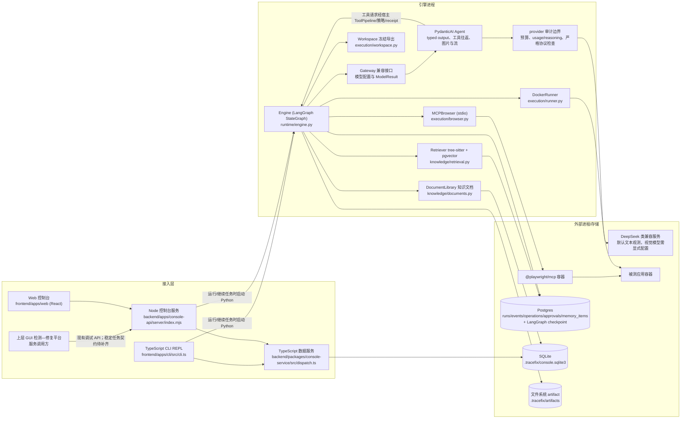
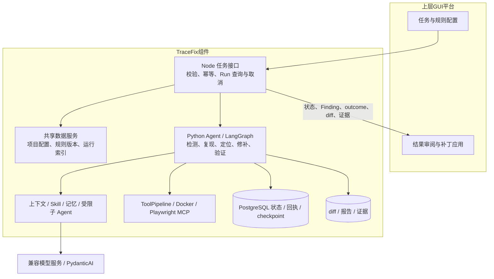

# 总体架构

TraceFix 是上层 GUI 检测—修复平台的 Agent 执行组件。平台提交任务并消费结果；TraceFix 负责检测、复现、定位、修补、验证及证据返回。平台身份、用户数据、任务编排、审批和远端交付由调用方承担。

## 1. 设计原则（现状已贯彻，目标架构继续保持）

| 原则 | 含义 | 现状证据 |
|---|---|---|
| 模型只提议，运行时执行 | PydanticAI Agent 提出受限工具调用或类型化结果；ToolRegistry 校验参数，宿主校验策略并执行，状态变更仍由运行时完成 | `agents/pydantic_ai_adapter.py:PydanticAIAdapter.generate`、`runtime/tools.py:ToolRegistry`、`runtime/engine.py:Engine.act` |
| 确定性门禁 | 修复是否成功由外部断言 + 六类验证决定，不由模型自报 | `contracts.py:278-289` |
| 证据可追溯 | 模型 I/O、截图、diff、验证结果均以 SHA256 命名的 artifact 存储 | `storage/artifacts.py:98-145` |
| 副作用幂等 | 浏览器操作走 intent-hash + receipt；已完成工具调用复用结果，结果未知时转人工核查 | `runtime/engine.py:Engine.operation`、`model/gateway.py:Gateway.generate` |
| 最小权限 | 容器 cap-drop、internal 网络、只读根文件系统、路径白名单 | `execution/runner.py:50-59,94-102`、`execution/workspace.py:93-105` |
| 不可信输入隔离 | 网页、源码、记忆、知识文档都视为数据而非指令 | `knowledge/context.py:6-12`、`model/prompts.py:7` |

## 2. 现状组件图



## 3. 现状模块职责

| 模块 | 路径 | 职责 | 规模 |
|---|---|---|---|
| 运行引擎 | `backend/packages/agent/src/tracefix/runtime/engine.py` | 12 节点状态图、工具执行与观测更新、幂等操作、审计及安全恢复 | 见 `Engine` |
| 数据契约 | `backend/packages/agent/src/tracefix/runtime/contracts.py` | Phase / RunState / TestSpec / PatchProposal / 门禁 | 289 行 |
| 续跑 | `backend/packages/agent/src/tracefix/runtime/continuation.py` | 非成功 Run 的继续执行状态构造 | 32 行 |
| 只读子任务 | `backend/packages/agent/src/tracefix/runtime/worker.py` | DIAGNOSE 阶段只读委派 | 62 行 |
| 模型执行 | `backend/packages/agent/src/tracefix/agents/pydantic_ai_adapter.py`、`backend/packages/agent/src/tracefix/model/*` | PydanticAI Agent、typed output、工具往返与输出校正；Gateway 兼容门面；provider 逐请求预算/审计、历史配对/证据投影、严格 SSE | 见 `PydanticAIAdapter`、`RequestBoundary`、`ModelProtocol` |
| 浏览器 | `backend/packages/agent/src/tracefix/execution/browser.py` | MCP client、动作翻译、断言、断线分类 | 409 行 |
| 沙箱 | `backend/packages/agent/src/tracefix/execution/runner.py` | docker run/exec、健康检查、浏览器容器命令 | 102 行 |
| 工作区 | `backend/packages/agent/src/tracefix/execution/workspace.py` | 权限过滤导出、补丁原子应用、本地分支 | 189 行 |
| 远程仓库 | `backend/packages/agent/src/tracefix/remote.py` | 仓库地址校验（只接受 github.com，与托管平台一致）、会话 / 项目两级配置合并、git clone（无认证） | 119 行 |
| 知识/检索 | `backend/packages/agent/src/tracefix/knowledge/*` | 上下文构建、知识文档、代码切块检索、文档选择 | ~510 行 |
| 存储 | `backend/packages/agent/src/tracefix/storage/*` | Postgres/内存 Store、artifact、checkpoint、中文展示 | ~530 行 |
| CLI 与数据服务 | `frontend/apps/cli/src/cli.ts`、`backend/packages/console-service/src/*` | TypeScript REPL、斜杠命令、项目/远程/知识管理及 Web 共享数据访问 | 分属前台应用与后台数据包 |
| Python Agent 入口 | `backend/packages/agent/src/tracefix/cli/*` | 引擎会话与旧入口兼容 | 见 `main.py` |
| Web 控制台 | `frontend/apps/web/src`、`frontend/packages`、`backend/apps/console-api/server` | 总览/运行/项目/知识库页面与 Node API | 前台功能包与后台 HTTP 应用 |
| 训练/评测 | `training/*`、`evals/*` | SFT/GRPO 脚本、评测用例与指标 | ~300 行 |

现状结构上的主要问题：

1. **两套存储并存**：Postgres 存权威运行状态，SQLite 存控制台索引和知识文档，两边靠 `agentRunId` 互相引用（`knowledge/documents.py:34-41`）。
2. **控制台已分离为前后台软件包**：`backend/apps/console-api/server/index.mjs` 为兼容现有行为保留 Todo 看板的 `/api/tasks` 路由；控制台数据请求直接调用 TypeScript 数据服务。独立演示目标位于 `bugboard/target`。
3. **任务 API 尚需补齐**：现有进程级启动 / 停止接口还需明确幂等提交、按 Run 取消、权威结果、重启与繁忙语义。
4. **交付边界**：Agent 返回候选 diff 和验证证据；push / PR 由上层平台处理，现有本地分支能力供调试使用。

### 3.1 已实现的模型与浏览器边界 ✅

- Python Test/Repair/Chat 的模型执行由 PydanticAI Agent 完成，Gateway 仅保留配置和 `generate` 兼容接口，返回 `ModelResult`。LangGraph 外层编排、checkpoint、interrupt 与 RunState/reducer 保留；ToolPipeline、审批、操作账本、UNKNOWN/resource fence、证据绑定、验证门和 Oracle 仍由宿主负责。
- `Decision` / `BrowserAction` 统一使用 `model/history.py` 的六个受限浏览器 function tools，Adapter 通过宿主端口执行，经策略与 operation receipt 后才由 MCP 调用；模型不直接访问 MCP。
- 工具模式配置、JSON 单动作路径与学生/教师浏览器策略路由已移除。`TestSpec`、`PatchProposal` 等保留现有 Pydantic schema；没有 Legacy 执行开关、依赖缺失回退或供应商自动切换。
- 默认文本模型为 `deepseek-chat`。未配置 `TRACEFIX_VISION_MODEL` 时不发送图片，仍保存截图证据；配置视觉模型后，携带图片的请求才使用该模型。供应商返回 `reasoning_content` 时，工具往返保留该字段并进入审计。
- `max_attempts` 默认 3，映射为首次输出后的两次校正机会；`max_tool_rounds` 默认 40，恢复历史也计入。每次实际请求均做 token 预算检查与 request/response/error、usage/reasoning 审计。provider/transport 不自动网络重试；明确未发送的请求由宿主判断安全恢复，断流、取消和未知副作用保留核查语义。

当前 provider 是面向 DeepSeek 等 OpenAI-compatible 服务的 `OpenAIChatModel` / `OpenAIProvider`；框架支持其他 provider 不代表 TraceFix 已接入全部协议。详细迁移职责见[框架接入说明](../../agent-framework-migration.md)，工具清单见[工具调用与 Skill](../03-Agent运行时/工具调用与Skill.md)，恢复条件见[主循环与状态机](../03-Agent运行时/主循环与状态机.md)。

## 4. 平台集成目标架构 📐

首版采用受信任的单实例执行器，平台排队并提交任务。复用现有 Node 接口层、TypeScript 数据服务和 Python Agent，不要求替换为新的 Python HTTP 服务。下图的稳定任务接口仍是待补齐设计。



### 4.1 接口与执行边界

| 范围 | TraceFix 交付 | 上层平台负责 |
|---|---|---|
| 输入 | 校验并冻结 repo / Profile / revision / TestSpec / 规则快照 | 授权任务、选择仓库与规则、提供可重置环境 |
| 执行 | 单 Run 主循环、受限工具、上下文 / 子任务、有界恢复 | 跨任务编排、服务入口认证和资源排队 |
| 缺陷来源 | 规则覆盖、Finding、复现证据及 Repair 来源绑定 | 选择待修 Finding，决定是否追加任务 |
| 输出 | 明确终态与 outcome、验证状态、当前 diff 和 artifact 引用 | 审阅、应用补丁、提交 / PR / 发布、通知 |
| 安全 | 仓库 / Run 归属、路径和网络策略、回执与 UNKNOWN 核查 | 平台用户数据、身份和权限、基础设施运维 |

完整接口草案与验收条件见[接口型 Beta 计划](../00-项目进度/接口型Beta最小补足与开发计划.md)。规则、代码定位、上下文、记忆和子 Agent 的扩展按业务效果推进，不要求建设独立规则后台、数据集平台或集群调度服务。

### 4.2 组件数据模型

```text
RepoProfile（受审项目配置 + 源码 revision）
├─ RuleSnapshot（规则 ID / 版本 / hash）
└─ Run（Test 或 Repair）
   ├─ TestSpec / ReproductionPlan
   ├─ Step / SubAgentRun
   ├─ Finding（规则绑定 + 复现状态）
   ├─ Guidance（调用方干预，现有能力）
   ├─ Patch / Verification（补丁与验证证据绑定）
   ├─ Operation / Receipt / Checkpoint
   └─ Artifact（截图 / diff / 模型 I/O / 报告）

Repair Run → 来源 Test Run + Finding + 冻结规则 / 证据
平台任务标识 → Run 关联（不建立平台用户与组织表）
```

这是目标契约，当前字段、表及接缝实现以源码和接口型 Beta 工作包为准。多仓库 / Run 隔离用于保证执行正确性，不建立多租户数据模型。

## 5. 技术选型延续

现有选型（LangGraph、MCP、tree-sitter、psycopg、Starlette、pydantic）继续沿用，详见 `docs/技术选型.md`。新增组件的选型在各功能文件中说明。
