# GitHub 接入与合并请求

说明从「用户指定 GitHub 仓库」到「远程出现 Pull Request」的完整交付链路。

> 已确认（2026-09-25）：代码托管在 **github.com**（公司在 github.com 上的组织），不使用 GitHub Enterprise Server；仓库地址由用户在**每个会话 / 任务中自行填写**，不是整个应用只配一个仓库。

## 1. 现状链路

```text
/remote set ──▶ git clone ──▶ 冻结导出工作区 ──▶ 启动应用容器 ──▶ 测试/修复/六类验证
 ✅(仅CLI,可按会话)  🟡(无认证)     ✅            🟡(需预配置)          ✅
──▶ 人工审批 ──▶ 本地分支 tracefix/run_* ──▶ push ──▶ 创建 PR
      ✅(仅CLI)        ✅                     🔴        🔴
```

| 步骤 | 状态 | 证据 | 说明 |
|---|---|---|---|
| 配置远程仓库 | 🟡 | `cli/workspace.py:184-218`、`cli/main.py:59,67-71,276`、`remote.py:84-89` | CLI 的 `/remote set` 已支持 `--scope session`（只存内存，优先于项目配置），但默认 `--scope project` 会持久保存（`cli/workspace.py:196`）；Web 没有入口 |
| 会话配置的生效范围 | 🟡 | `cli/main.py:275,282,284-285,309` | 会话配置只替换代码目录；启动命令、镜像、允许修改的文件、被测应用地址仍来自已注册项目，换一个技术栈不同的仓库就跑不起来 |
| 仓库地址校验 | ✅ | `remote.py:17-28` | 只接受 `owner/repo` 或 `https://github.com/...`（`remote.py:22`），与托管平台一致 |
| clone | 🟡 | `remote.py:101-114` | `git clone --single-branch`，argv 调用，无 shell；地址固定为 `https://github.com/{repo}.git`（`remote.py:109`），超时固定 120 秒；目标目录已是 Git 工作区时直接复用，不 fetch（`remote.py:101-104`） |
| 认证 | 🔴 | `src/` 中没有引用 `TRACEFIX_GITHUB_TOKEN`（只在 `backend/apps/console-api/server/index.mjs:107` 中用于日志脱敏） | 只能 clone 公开仓库，或依赖本机 credential helper；私有仓库没有凭据时，git 会在终端提示输入或直接失败 |
| 冻结导出 | ✅ | `execution/workspace.py:52-91` | 按白名单导出，丢弃历史，`git init` 后生成单个 commit |
| 依赖/镜像 | 🟡 | `tools/bootstrap/bootstrap.py:257-258`、`config.py:29-55` | 镜像需预构建，Profile 需人工编写，不支持任意仓库零配置接入 |
| 启动 / 健康检查 | ✅ | `execution/runner.py:48-72` | docker run + 健康轮询 30 次 |
| 验证 | ✅ | `runtime/engine.py:546-590` | static / unit / build / health / original / regression |
| 审批 | ✅ | `runtime/engine.py:587-600` | 审批记录与 patch_hash 绑定，只允许 `local_commit` |
| 本地分支 | ✅ | `execution/workspace.py:181-189` | 分支名必须以 `tracefix/run_` 开头 |
| push / PR | 🔴 | `src/` 全文检索无相关调用；`engine.py:645` 报告中 `merged` 恒为 False | `remote_write` 只存不用（`cli/workspace.py:213`） |

现存问题：

- 提交作者硬编码为 `z4qcpz-5sry35`（`execution/workspace.py:90,188`），既不可配置，也泄露了开发者的个人标识。
- `tools/github/prepare_github_run.py` 与 `remote.py` 功能重复，主链路也没有调用它，是孤儿脚本。
- 冻结导出工作区与原仓库历史不相关，**不能直接 push**。发布时必须把已验证的 diff 回放到保留 origin 历史的检出目录上。

## 2. 目标链路 📐

```mermaid
sequenceDiagram
  participant U as 用户
  participant API as 控制面
  participant W as Worker
  participant GH as GitHub(github.com)
  U->>API: 填写仓库地址(本会话/任务) + 任务说明书
  API->>API: 校验为 github.com 仓库且 App 已安装，按仓库解析 Profile(无则探测→草稿→用户确认)
  API->>GH: 获取 installation token(只读 contents)
  API->>W: 派发 Job
  W->>GH: clone 发布检出(保留历史, 记录 base_sha)
  W->>W: 冻结导出 → 测试/修复/验证(现有状态机)
  W->>U: 补丁审批(Web/CLI)
  U->>W: 批准
  W->>W: PUBLISH: 在发布检出上基于 base_sha 建分支并 git apply --3way
  W->>GH: 获取 installation token(contents:write, pull_requests:write)
  W->>GH: push tracefix/<job>/<slug>
  W->>GH: POST /repos/{o}/{r}/pulls (draft)
  GH-->>W: PR URL
  W->>API: 事件 pr.created
  API-->>U: 显示 PR 链接
  API->>GH: 拉取 PR 评审意见(手动触发，M5 起轮询)
  API->>API: 文本模型用单独的 system prompt 整理成提示词 → 用户确认
  API->>W: 启动修订 Run(从 PR 分支 head 出发)
  W->>GH: 在同一 PR 追加 commit, 逐条回复评论
```



评审意见的整理、确认和修订见 `03-Agent运行时/PR评审意见驱动修复.md`。

### 2.0 会话级仓库配置

| 项 | 设计 |
|---|---|
| 填写方式 | 用户在每个会话 / 任务中填写 `https://github.com/<owner>/<repo>` 或 `owner/repo`。CLI 用 `/remote set` 或 `tracefix run --repo`，Web 在任务向导中直接填写 |
| 作用域 | 仓库、基线分支、工作分支默认只在当前会话有效（`/remote set` 的默认作用域从 project 改为 session）；项目级配置只是可选的默认值；同一进程里的多个会话互不影响 |
| 地址校验 | 只接受 github.com 仓库（现有 `remote.py:17-28` 已满足），凭据只会发往 github.com / api.github.com |
| Profile 解析 | 按 `owner/repo` 查找已审计的 Profile，与「已注册项目」解耦；没有就走 2.2 节的接入流程，在会话中确认。审计结果按「仓库 + lockfile 哈希」缓存 |
| 网络 | 内网经出口代理访问 github.com（git 使用 `http.proxy`，httpx 使用 `proxy`）；代理解密 TLS 时再配置公司 CA，否则使用系统默认 CA |

### 2.1 认证与凭据

凭据由部署统一管理，用户不需要每个会话都填写。

| 方式 | 适用 | 权限 | 说明 |
|---|---|---|---|
| 安装在公司 github.com 组织上的 GitHub App（推荐） | 团队 / 企业 | `metadata:read`、`contents:write`、`pull_requests:write`、`checks:write`，可选 `issues:read` | installation token 有效期 1 小时，按阶段申请最小权限；能访问哪些仓库由安装范围决定；安装需要组织 owner 批准，应尽早发起 |
| bot 账号的 fine-grained PAT | 过渡方案 | 限定组织内的指定仓库 | 存放在公司密钥管理系统中；组织可能要求审批 fine-grained PAT |
| 用户自己的 PAT | 个人模式 | 限定单个仓库 | 加密存储在本机密钥库（keyring） |
| SSH deploy key | 私有部署 | 单仓库写 | 只用于 push，PR 仍需走 API token |

组织启用了 SAML SSO 时，PAT 要先完成 SSO 授权才能访问组织仓库。

凭据规则：

- token 只在 clone 和 PUBLISH 两个步骤注入，形式是临时的 `GIT_ASKPASS` 或一次性 credential helper，用完即删。
- token 不进入应用容器、浏览器容器和模型上下文。
- token 日志脱敏：在现有正则脱敏（`storage/artifacts.py:12-28`）的基础上，额外按已注入的精确值反查替换。
- 服务端存储：用 KMS 或 age 加密后存 Postgres，解密只发生在 Worker 内存中。

### 2.2 仓库接入（Onboarding）

目标是把「任意仓库 → 可运行 Profile」从纯人工变成「自动探测 + 人工确认」：

1. **探测**：lockfile（npm/pnpm/yarn）、框架（Vite / Next.js / CRA / Vue CLI）、`package.json` scripts（dev/build/test/lint）、端口、已有的 `Dockerfile`、`docker-compose.yml`、`.devcontainer`。
2. **生成草稿**：Profile YAML（启动/重置/静态检查/单测/构建命令，health_path，allowed_files）和 Dockerfile 草稿。
3. **人工审计**：首次在会话中使用该仓库时，由用户逐条确认命令（CLI 交互确认，或在 Web 任务向导 / 仓库默认设置中确认），沿用 `config.py:43-55` 的已审计命令模板思想。
4. **构建**：在隔离的构建网络中执行，只放行包镜像源白名单；以 lockfile 哈希作为缓存键。
5. **冒烟**：启动 → 健康检查 → 首页快照，全部通过后 Profile 才标记为「可用」。

### 2.3 发布阶段（PUBLISH）

在状态机的 REVIEW 与 FINALIZE 之间新增 `Phase.PUBLISH`：

| 步骤 | 动作 | 失败处理 |
|---|---|---|
| 1 | 校验：`patch_hash` 与审批记录一致；导出时记录的 `base_sha` 仍可达 | 不一致则拒绝发布 |
| 2 | 在发布检出上 `git switch -c tracefix/<job>/<slug>-<run短ID> <base_sha>` | 分支已存在且属于本 Run 时复用（幂等） |
| 3 | `git apply --3way` 应用已验证的 diff | 冲突则标记 `PUBLISH_CONFLICT`，生成续跑 Run |
| 4 | commit：身份可配置（默认使用 GitHub App 的 bot 身份 `<app名>[bot]`，使用 PAT 时为对应的 bot 账号），trailer 写入 `TraceFix-Run`、`TraceFix-Patch-Hash`、审批人 | 可选 GPG/SSH 签名 |
| 5 | base 分支已前进：fetch 后检测是否冲突；无冲突时 rebase，并在新 base 上重跑 original + regression 验证 | 验证不过则退回 DIAGNOSE |
| 6 | `git push --force-with-lease`（只针对 `tracefix/` 前缀分支） | 分支保护、权限不足时转人工 |
| 7 | 创建 PR：先按 head 分支查询是否已有 open PR，保证幂等；默认 draft | 遇二级速率限制时按 `Retry-After` 退避 |
| 8 | 写入 `pull_request` 记录（number / url / head / base / state），发出事件 `pr.created` | — |

PR 描述模板（中文，可按项目覆盖）：

```markdown
## 缺陷描述            ← TestSpec.goal + 命中的规则
## 复现步骤            ← 冻结的重放计划（人类可读）
## 根因分析            ← PatchProposal.summary + 代码情报证据
## 修改说明            ← 文件列表 + 变更符号
## 验证结果            ← 六类验证逐项 ✅/❌ + 证据链接
## 截图                ← 内部报告链接（修复前 / 修复后截图不上传到 github.com）
## 风险与影响范围       ← 变更符号的引用方（AST 分析）
---
TraceFix Run: run_xxx · Patch: <hash前12位> · 审批人: @xxx
```

github.com 是外部服务：PR 正文只放文字摘要、验证结果和内部报告链接；截图、日志等运行产物留在内网；推送前对 diff 和 PR 正文做 secret scanning。

### 2.4 发布策略

| 策略 | 行为 |
|---|---|
| `manual`（默认） | 补丁审批后，再单独审批发布 |
| `auto-draft` | 补丁审批通过后自动 push，并创建 draft PR |
| `auto-ready` | 仅限组织管理员开启，并且要求规则集中的所有 blocker 规则都已通过 |

无写权限时使用 fork 模式：把 fork 建在 bot 账号下，从 fork 发起 PR。

### 2.5 实现方式选择

| 方案 | 优点 | 缺点 | 结论 |
|---|---|---|---|
| git CLI + GitHub REST（`https://api.github.com`，httpx） | 确定性强，可纳入 operation receipt 幂等，易于用假服务器测试 | 需要自己封装 API | **主路径** |
| GitHub MCP server | 与 MCP 生态统一 | 发布不需要模型参与，引入 MCP 反而扩大攻击面 | 可选适配器，默认关闭 |
| gh CLI | 开发快 | 依赖外部二进制，输出解析脆弱 | 不采用 |

抽象接口 `RepoProvider`：`clone_url()`、`publish_branch()`、`open_pull_request()`、`comment()`、`get_pull_request()`。GitHub（github.com）是主实现；GHES、GitLab、Gitee 作为预留扩展点。Checks API 的写权限只对 GitHub App 开放，使用 PAT 时降级为 commit status。

### 2.6 事件接收

内网部署的服务收不到 github.com 的 Webhook，先用轮询：

| 项 | 设计 |
|---|---|
| 轮询对象 | TraceFix 创建的、仍处于 open 状态的 PR（评论、评审、check 状态、合并状态），以及带 `tracefix` 标签的 Issue |
| 频率 | 默认每 2 分钟一次；PR 超过 7 天没有新活动后降为每 30 分钟一次 |
| 配额 | 使用 ETag 条件请求，返回 304 时不消耗主速率配额 |
| 触发 | PR 评论中的 `/tracefix` 指令、「请求修改」的评审 → 生成评审意见整理结果，通知任务负责人确认后启动修订 Run（见 `03-Agent运行时/PR评审意见驱动修复.md`）；PR 合并或关闭后停止轮询，并回填 `human_decision` |
| 升级 | 运维能提供公网入口时切换为 Webhook：入口服务校验 `X-Hub-Signature-256` 签名后转发到内网，轮询保留为补偿机制 |

## 3. 测试策略

- 本地假 GitHub 服务（HTTP stub），覆盖 PR 创建、已有 PR、速率限制（含 `Retry-After`）、401/403/422、304 条件请求等响应；另覆盖同一进程中两个会话分别配置不同仓库、非 github.com 地址被拒绝、令牌不出现在命令行和日志中。
- 使用本地 bare 仓库作为 origin，验证分支、trailer 和 `--force-with-lease` 行为。
- 用 github.com 上的沙箱仓库（独立测试组织，或组织内的专用私有仓库）做夜间 E2E：Draft PR 创建后自动关闭。
