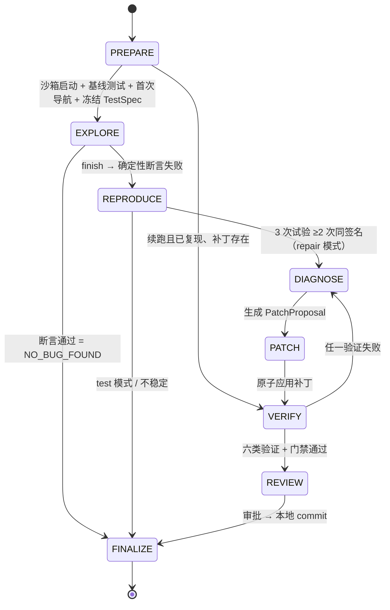
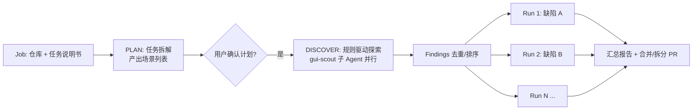

# 主循环与状态机

## 1. 现状

### 1.1 图结构

`Engine._graph` 基于 LangGraph `StateGraph` 构建单图多节点状态机（`backend/packages/agent/src/tracefix/runtime/engine.py`）：

- 节点：`prelude, prepare, decide, execute, explore_gate, reproduce, diagnose, patch, verify, review, paused, finalize`（`engine.py:261-262`）。
- 每个节点都由统一的 `wrapped` 包装，负责异常分类和已持久化用量合并，然后按 `next_node` 做条件路由。
- 每次回到 `prelude` 都会检查取消 / 暂停 / 用户输入，这是唯一的安全打断点（`engine.py:324-339`）。
- checkpoint 使用 LangGraph `PostgresSaver`，以 `thread_id = run_id` 支持 `interrupt()` / `Command(resume=...)`（`storage/checkpoints.py`，`engine.py:679-696`）。

节点内的 Python 模型调用通过 `Engine.model_call → Gateway.generate → PydanticAIAdapter → PydanticAI Agent` 执行。框架接管 typed output 与局部工具往返，返回现有 `ModelResult`；外层 LangGraph、RunState/reducer、阶段转移、checkpoint 和 interrupt 保留。ToolPipeline、审批、操作账本、UNKNOWN/resource fence、证据绑定、验证门和 Oracle 继续由宿主负责，详见 [框架接入说明](../../agent-framework-migration.md)。

### 1.2 阶段与转移



| 约束 | 证据 |
|---|---|
| 合法转移表 `TRANSITIONS` | `contracts.py:242-251` |
| `run_id / scope_id / mode / goal / url` 不可变 | `contracts.py:252` |
| TestSpec 冻结后不可变 | `contracts.py:262-264` |
| 进入 PATCH 前必须已复现且源码对齐 | `contracts.py:270-271` |
| `patch_hash` 变化时清空验证记录和审批 | `contracts.py:272-274` |
| 乐观并发 `revision` | `contracts.py:256-257`、`engine.py:106-115` |
| 六类验证 + 证据存在性门禁 | `contracts.py:278-289` |

### 1.3 失败处理

| 异常 | 去向 | 证据 |
|---|---|---|
| `UnknownOperation`（副作用缺少 receipt） | PAUSED，需要人工核查，不盲目重放 | `Engine.operation`、`Engine._graph` |
| 模型/MCP 的 `WAITING_NETWORK`、`UNKNOWN_OPERATION` | PAUSED；仅确定 `not_sent` 且无需人工核查的模型请求允许安全恢复；这些状态优先于循环终止判断 | `Engine._graph`、`Engine.paused` |
| native 工具执行前的明确策略拒绝、定位器无法绑定 | 返回 `isError=true`、`executed=false` 和当前观测；未创建浏览器 operation | `Engine.model_call.execute_tool` |
| scope 撤销、工具可能已执行但结果不明 | 不转成可纠正工具结果，不继续浏览器交互；未知结果进入暂停核查 | `Engine.model_call`、`Gateway.generate` |
| 节点中的 `PermissionError` / `ModelOutputError` | 记录反馈并重新决策；重复错误由循环检测处理 | `Engine._graph` |
| 冻结重放无法绑定 | 清空重放计划；REPRODUCE 回 EXPLORE，验证阶段回 DIAGNOSE | `Engine.act`、`Engine._graph` |
| 其他异常 | 已提交实现仍进入 FINALIZE，结果为 `INFRA_FAILURE` | `Engine._graph` |

📐 将其他异常统一改为暂停、门禁证据失效时重新验证等仍是后续工作；本次原生工具和重试提交不代表这些通用异常策略已完成。

### 1.4 用量计量与单次交互防护 ✅

`RunState.budget` 保留历史字段名，实际使用 `Usage` 累计模型请求、浏览器动作、补丁、子任务、token 等用量；旧预算字段兼容读取，但不作为 Run 上限。循环检测使用状态、动作、错误和无进展信号。

这不取消模型交互防护：`TRACEFIX_MODEL_MAX_ATTEMPTS` 默认 3，映射为 PydanticAI `output_retries=2`，只控制首次输出后的校正机会；不是每个 HTTP 请求的网络重试次数。`Gateway.max_tool_rounds` 默认 40，限制单次逻辑交互的工具轮次，恢复的历史轮次同样计入。完成工具后的输出校正复用结果，不重新执行已完成动作。

OpenAI SDK 与 HTTP transport 的自动重试均为 0；连接失败、HTTP 429/5xx、读取超时和断流不自动退避重试。确定 `not_sent` 的连接错误为 `WAITING_NETWORK`，宿主可判定安全恢复；已发请求结果未知为 `UNKNOWN_OPERATION`，需暂停核查。模型拒绝或内容过滤不按普通输出校验错误重试。

`model/protocol.py:RequestBoundary` 对每次实际 provider 请求检查上下文预算、生成 `context_manifest`，并记录 request/response/error、`logical_exchange_id`、attempt 和工具轮次。工具后续请求和输出校正请求都独立记录原始 usage/reasoning 并累计已知用量；断流保留部分响应与未知计费状态，取消传播而不伪造成功。

### 1.5 PydanticAI 工具往返与安全恢复 ✅

1. `decide` 提供文本观测、冻结 TestSpec 和证据引用；默认不发图，只有配置 `TRACEFIX_VISION_MODEL` 才向模型发送截图。
2. PydanticAI Agent 注册阶段允许的 ToolSpec，provider 边界整批校验工具 ID、名称、参数和 schema 后调用宿主端口。浏览器写/外部动作串行，仍经过 policy、operation receipt 和 MCP，并更新 observation、重放计划和审计。
3. 框架维护工具往返，`model/history.py` 统一校验与转换配对的 assistant/tool 消息；供应商提供的原始 `tool_call_id` 和 `reasoning_content` 保留。宿主提供 context/guidance/规则/Skill 刷新，后续动作绑定最新观测。
4. native 最终输出只能请求 `finish`，随后仍由 `execute → explore_gate` 执行确定性断言；finish 不等于成功。显式 `TRACEFIX_TOOL_MODE=json` 返回单动作 JSON 契约，执行后端同样是 PydanticAI；`TestSpec` / `PatchProposal` 等保留现有 schema。
5. 若工具完成后模型请求确定未发送，不自动网络重试；宿主暂停并保留失败元数据。安全 resume 按 schema 与原 `logical_exchange_id` 核对恢复历史，复用已完成结果并继续累计轮次。成功后才清除恢复信息；未知状态阻止普通 resume。

详细函数参数和错误边界见[工具调用与 Skill](工具调用与Skill.md)，MCP 映射见[浏览器 MCP 接入](浏览器MCP接入.md)。

### 1.6 现状的局限

1. **目标驱动而非发现驱动**：一个 Run 只处理用户描述的一个场景，没有「扫描应用 → 按规则发现多个缺陷」的阶段。
2. **没有发布阶段**：REVIEW 之后直接 FINALIZE（`engine.py:607`）。
3. **用户输入只记录不生效**：`prelude` 把 `notes` 记为 `input.applied` 事件后直接清空，不注入模型上下文（`engine.py:335-338`）。
4. **浏览器交互仍串行**：PydanticAI 的工具往返保留副作用串行；`parallel_safe` 的 `none/read` 工具可有限并发，Adapter 默认上界 4。每次实际 provider 请求独立计量，控制指令仍由宿主安全边界处理。
5. **诊断仅一轮**：DIAGNOSE 直接产出完整补丁，中间没有「假设 → 取证 → 收敛」的多步推理循环。
6. **驳回与交付无法区分**：补丁审批被驳回后，结果仍是 `FIX_VERIFIED`、状态为 `COMPLETED`，只是不建分支（`engine.py:600-607`）。需要新增交付状态字段，详见 `全周期状态流转.md` 2.4 节。

## 2. 目标设计 📐

### 2.1 两级编排：Job → Run



- **Job 编排器**（新增，`runtime/orchestrator.py`）：负责 PLAN 和 DISCOVER、Run 并发调度（每个 Run 独立沙箱；同时运行的数量由 Worker 资源决定，资源不足时排队），以及结果汇总。
- **Run 引擎**：沿用现有状态机，在其基础上扩展阶段。
- 用户直接给出明确的缺陷描述时，跳过 DISCOVER，直接创建单个 Run（兼容现有行为）。

### 2.2 Run 阶段扩展

| 阶段 | 新增/变化 | 说明 |
|---|---|---|
| PREPARE | 变化 | 增加：规则集快照冻结（`rule_snapshot_hash`）、代码索引预热 |
| EXPLORE | 变化 | 每次观测后执行确定性规则 oracle（console 错误、网络 5xx、a11y），命中即生成 Finding |
| REPRODUCE | 不变 | — |
| DIAGNOSE | 变化 | 改为多步子循环：假设 → 调用代码情报工具取证 → 更新工作记忆 → 收敛后产出补丁；可派发只读子 Agent |
| PATCH | 变化 | 应用前做预验证：语法解析、`tsc` 诊断增量、lint 增量；失败直接退回 DIAGNOSE，不触发昂贵的 GUI 验证 |
| VERIFY | 变化 | 追加：规则回归（本 Run 冻结规则集中的 oracle 规则全部重跑） |
| REVIEW | 变化 | 可选的 reviewer 子 Agent 先出审查意见，再交给人工审批 |
| **PUBLISH** | 新增 | push + PR，详见 `02-仓库交付流水线` |
| FINALIZE | 变化 | 增加：轨迹导出、质量评分、记忆沉淀候选 |

新的转移表增量：

```python
TRANSITIONS[Phase.REVIEW] = {Phase.PUBLISH, Phase.FINALIZE}
TRANSITIONS[Phase.PUBLISH] = {Phase.FINALIZE, Phase.DIAGNOSE}  # rebase 后验证失败时退回
TRANSITIONS[Phase.PATCH] = {Phase.VERIFY, Phase.DIAGNOSE, Phase.FINALIZE}  # 预验证失败时退回
# 修订 Run（kind=review_revision）：reduce_state 中开放 PREPARE → DIAGNOSE，与现有的续跑例外同类
```

PR 发出之后，Run 进入终止状态，由 PR 跟踪继续等待评审，并派生修订 Run。完整的状态与转换条件见 `全周期状态流转.md`。

### 2.3 DIAGNOSE 子循环

```text
diagnose_plan  → 模型输出 Hypotheses[] + 需要的证据（工具调用）
diagnose_probe → 运行时执行只读工具（code.search / code.symbols / code.references / browser.console ...）
diagnose_judge → 模型更新假设置信度；收敛（置信度 ≥ 阈值）→ 产出 PatchProposal
```

- 每轮的假设和证据都写入 `hypothesis_refs`（字段已存在，`contracts.py:214`），用作工作记忆，并进入轨迹。
- 不设 probe 轮数上限。反复用相同参数调用同一个工具、结果没有变化，或者多轮取证都没有新证据，都属于重复或无进展，由死循环检测处理。

### 2.4 安全打断点与干预

`prelude` 继续作为唯一的安全边界点，但处理逻辑升级：

1. 控制类（cancel / pause）：行为不变。
2. 用户引导（hint / constraint / retarget）：分类后处理，详见 `用户提示词干预.md`。
3. 上下文压缩检查：token 使用超过阈值时执行 compact，详见 `06-上下文与子Agent/记忆与上下文压缩.md`。

### 2.5 长时间运行保障

| 能力 | 设计 |
|---|---|
| 心跳 | Worker 每 15 秒写入 `runs.heartbeat_at`；超时后由调度器接管，从 checkpoint 恢复 |
| 运行时长 | Job 和 Run 都不设截止时间。唯一的自动退出是死循环检测：在每个安全边界检查状态重复、动作周期、补丁重复、错误重复和无进展，判定后以 `LOOP_DETECTED` 结束并标记为异常（见开发计划 3.3 节） |
| 进程重启恢复 | 基于 LangGraph checkpoint 与 operation receipt；浏览器状态不可恢复时，从冻结场景重放（沿用现有 `/resume` 规则） |
| 资源回收 | 孤儿容器巡检：扫描带 `tf-` 前缀的容器和网络，所属 Run 已终止、或其 Worker 心跳已失效的，予以清理 |
