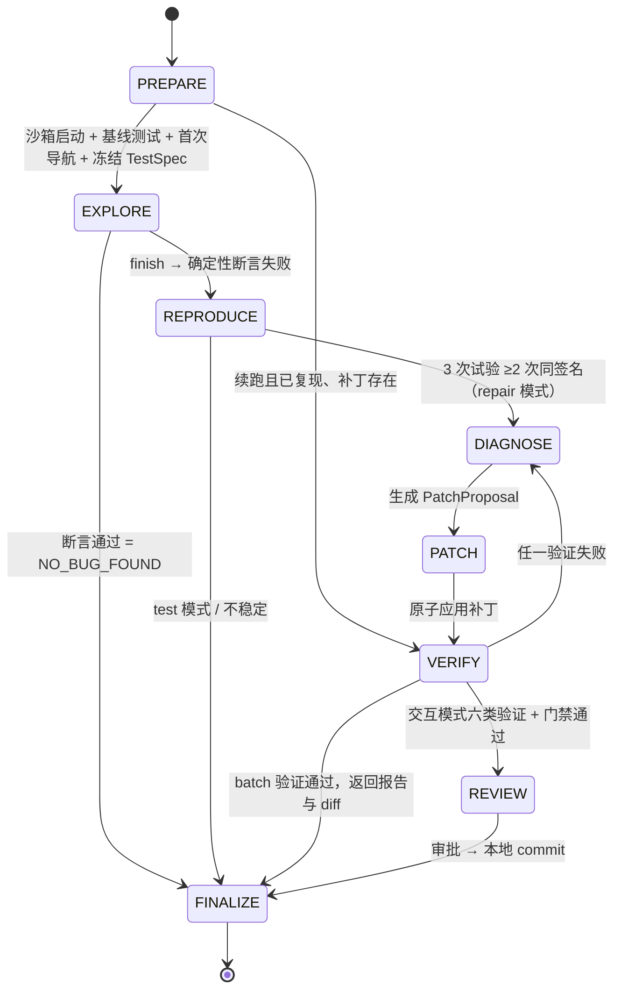

# 主循环与状态机

> 定位更新：2026-10-07。运行时负责平台任务内的 Agent 执行；跨任务 Job 编排、审批 / PR 跟踪和发布由上层 GUI 平台处理。现状代码与验收证据见[完成度评估](../00-项目进度/完成度评估.md)。

## 1. 现状

### 1.1 图结构

`Engine._graph` 基于 LangGraph `StateGraph` 构建单图多节点状态机（`backend/packages/agent/src/tracefix/runtime/engine.py`）：

- 节点：`prelude, prepare, decide, execute, explore_gate, reproduce, diagnose, patch, verify, review, paused, finalize`（`engine.py:261-262`）。
- 每个节点都由统一的 `wrapped` 包装，负责异常分类和已持久化用量合并，然后按 `next_node` 做条件路由。
- 每次回到 `prelude` 都会检查取消 / 暂停 / 用户输入，这是唯一的安全打断点（`engine.py:324-339`）。
- checkpoint 使用 LangGraph `PostgresSaver`，以 `thread_id = run_id` 支持 `interrupt()` / `Command(resume=...)`（`storage/checkpoints.py`，`engine.py:679-696`）。

节点内的 Python 模型调用通过 `Engine.model_call → Gateway.generate → PydanticAIAdapter → PydanticAI Agent` 执行。框架接管 typed output 与局部工具往返，返回现有 `ModelResult`；外层 LangGraph、RunState/reducer、阶段转移、checkpoint 和 interrupt 保留。ToolPipeline、审批、操作账本、UNKNOWN/resource fence、证据绑定、验证门和 Oracle 继续由宿主负责，详见 [框架接入说明](../../agent-framework-migration.md)。

### 1.2 阶段与转移

| 约束 | 证据 |
|---|---|
| 合法转移表 `TRANSITIONS` | `contracts.py:242-251` |
| `run_id / scope_id / mode / goal / url` 不可变 | `contracts.py:252` |
| TestSpec 冻结后不可变 | `contracts.py:262-264` |
| 进入 PATCH 前必须已复现且源码对齐 | `contracts.py:270-271` |
| `patch_hash` 变化时清空验证记录和审批 | `contracts.py:272-274` |
| 乐观并发 `revision` | `contracts.py:256-257`、`engine.py:106-115` |
| 六类验证 + 证据存在性门禁 | `contracts.py:278-289` |

### 1.3 失败处理

| 异常 | 去向 | 证据 |
|---|---|---|
| `UnknownOperation`（副作用缺少 receipt） | PAUSED，需要人工核查，不盲目重放 | `Engine.operation`、`Engine._graph` |
| 模型/MCP 的 `WAITING_NETWORK`、`UNKNOWN_OPERATION` | PAUSED；仅确定 `not_sent` 且无需人工核查的模型请求允许安全恢复；这些状态优先于循环终止判断 | `Engine._graph`、`Engine.paused` |
| native 工具执行前的明确策略拒绝、定位器无法绑定 | 返回 `isError=true`、`executed=false` 和当前观测；未创建浏览器 operation | `Engine.model_call.execute_tool` |
| scope 撤销、工具可能已执行但结果不明 | 不转成可纠正工具结果，不继续浏览器交互；未知结果进入暂停核查 | `Engine.model_call`、`Gateway.generate` |
| 节点中的 `PermissionError` / `ModelOutputError` | 记录反馈并重新决策；重复错误由循环检测处理 | `Engine._graph` |
| 冻结重放无法绑定 | 清空重放计划；REPRODUCE 回 EXPLORE，验证阶段回 DIAGNOSE | `Engine.act`、`Engine._graph` |
| 其他异常 | 已提交实现仍进入 FINALIZE，结果为 `INFRA_FAILURE` | `Engine._graph` |

上表描述相关交互分支；batch 对不能安全继续的错误输出终态与报告，不无限等待人工输入。具体最新恢复、失效证据和异常收尾状态以[完成度评估](../00-项目进度/完成度评估.md)的原始核查记录为准；接口可靠性按 B4 / B5 验收。

### 1.4 用量计量与单次交互防护 ✅

`RunState.budget` 保留历史字段名，实际使用 `Usage` 累计模型请求、浏览器动作、补丁、子任务、token 等用量；旧预算字段兼容读取，但不作为 Run 上限。循环检测使用状态、动作、错误和无进展信号。

这不取消模型交互防护：`TRACEFIX_MODEL_MAX_ATTEMPTS` 默认 3，映射为 PydanticAI `output_retries=2`，只控制首次输出后的校正机会；不是每个 HTTP 请求的网络重试次数。`Gateway.max_tool_rounds` 默认 40，限制单次逻辑交互的工具轮次，恢复的历史轮次同样计入。完成工具后的输出校正复用结果，不重新执行已完成动作。

OpenAI SDK 与 HTTP transport 的自动重试均为 0；连接失败、HTTP 429/5xx、读取超时和断流不自动退避重试。确定 `not_sent` 的连接错误为 `WAITING_NETWORK`，宿主可判定安全恢复；已发请求结果未知为 `UNKNOWN_OPERATION`，需暂停核查。模型拒绝或内容过滤不按普通输出校验错误重试。

`model/protocol.py:RequestBoundary` 对每次实际 provider 请求检查上下文预算、生成 `context_manifest`，并记录 request/response/error、`logical_exchange_id`、attempt 和工具轮次。工具后续请求和输出校正请求都独立记录原始 usage/reasoning 并累计已知用量；断流保留部分响应与未知计费状态，取消传播而不伪造成功。

### 1.5 PydanticAI 工具往返与安全恢复 ✅

1. `decide` 提供文本观测、冻结 TestSpec 和证据引用；默认不发图，只有配置 `TRACEFIX_VISION_MODEL` 才向模型发送截图。
2. PydanticAI Agent 注册阶段允许的 ToolSpec，provider 边界整批校验工具 ID、名称、参数和 schema 后调用宿主端口。浏览器写/外部动作串行，仍经过 policy、operation receipt 和 MCP，并更新 observation、重放计划和审计。
3. 框架维护工具往返，`model/history.py` 统一校验与转换配对的 assistant/tool 消息；供应商提供的原始 `tool_call_id` 和 `reasoning_content` 保留。宿主提供 context/guidance/规则/Skill 刷新，后续动作绑定最新观测。
4. 原生工具交互的最终输出只能请求 `finish`，随后仍由 `execute → explore_gate` 执行确定性断言；finish 不等于成功。工具模式开关与 JSON 单动作路径已移除；`TestSpec` / `PatchProposal` 等保留现有 schema。
5. 若工具完成后模型请求确定未发送，不自动网络重试；宿主暂停并保留失败元数据。安全 resume 按 schema 与原 `logical_exchange_id` 核对恢复历史，复用已完成结果并继续累计轮次。成功后才清除恢复信息；未知状态阻止普通 resume。

详细函数参数和错误边界见[工具调用与 Skill](工具调用与Skill.md)，MCP 映射见[浏览器 MCP 接入](浏览器MCP接入.md)。

### 1.6 当前交付与保留边界

- 运行时已有分级 Guidance、阶段规则刷新、只读调查、局部编辑反馈和有界恢复；历史“输入只记录不生效”“诊断仅一轮”不能作为新的待开发结论。
- 单 Run 结果由冻结规范、复现与当前补丁验证决定。发现多个缺陷后的跨 Run 排队、结果聚合和任务审批由平台编排。
- `FIX_VERIFIED` 表示补丁验证结论，不代表已经应用、提交或发布；平台消费 diff 和证据，现有交互拒绝提交不会改写验证历史。
- 稳定任务 API、Finding → Repair 来源绑定、指定 Run 取消与重启状态仍按 B0–B5 补齐。真实恢复、长期效果与 held-out / 四格保持独立待验收状态。

## 2. 平台集成与 Agent 能力扩展 📐

### 2.1 单 Run 与平台编排

TaskBrief / PLAN 可作为 Agent 计划能力扩展，但不要求新增平台级 Job 服务。仓库、目标、规范与规则在各 Run 内冻结，来源 Test Run / Finding 绑定到 Repair；跨任务排队和多缺陷选择由调用方处理。

### 2.2 范围内演进

| 阶段 | 已有基础 / 后续验收 |
|---|---|
| PREPARE | 冻结 Profile / revision / TestSpec / 规则，核验平台输入与环境就绪 |
| EXPLORE | 按新鲜观测更新规则，返回覆盖与 Finding，不把未检查规则计为通过 |
| REPRODUCE | 选择并冻结可执行计划，重置后独立重放确认 |
| DIAGNOSE | 用版本化源码与证据验证假设，调用受限只读调查 |
| PATCH | exact anchor / before_hash / overlay、结构化失败反馈；按业务需要扩展预验证 |
| VERIFY | 当前补丁的原问题、逆向 / 刷新 / 正常业务与工程验证；失效证据不复用 |
| REVIEW | 保留现有本地交互审批；接口任务不依赖平台外的 TTY 等待 |
| FINALIZE | 返回明确结果、候选 diff、验证与证据引用，保存后再展示 |

不新增 PUBLISH 或 PR 跟踪阶段。验证结论和平台交付状态分开，详见[Agent 执行与平台交接状态](全周期状态流转.md)。

### 2.3 诊断与安全干预

诊断记录支持 / 反证 / 预测、最小探针、版本化源码引用与当前假设。继续调查须带来新证据；重复或无进展由有界恢复控制收敛，不依赖无限 probe。

安全边界处理 cancel / pause、Guidance 与 compact。Guidance 可以补充线索或收窄约束；改目标需显式确认并派生 Run，不能覆盖冻结 TestSpec、权限或验证门。详见[运行中干预](用户提示词干预.md)。

### 2.4 长任务与故障边界

| 情况 | 约束 |
|---|---|
| 等待子任务 | 绑定原 child 身份，等待 / 恢复有界；更换引用不重获无进展额度 |
| 观测过期 | 重新 observe 与语义绑定，不复用旧页面句柄 |
| 上下文不足 | compact 保护目标、规范、规则和来源；无法满足窗口则明确失败或暂停 |
| 结果 UNKNOWN | 保留核查要求，不盲目重放外部副作用 |
| 重启 | 依赖 checkpoint / receipt 核对状态；不承诺任意浏览器阶段透明恢复 |
| 资源 | 首版单实例由平台排队；不新增持久化集群队列或自动跨 Worker 接管 |

真实故障、取消、UNKNOWN、结果与 artifact 绑定按[接口型 Beta 计划](../00-项目进度/接口型Beta最小补足与开发计划.md)验收；已有 mock / fixture 通过不等于真实长期可靠性已经证明。
