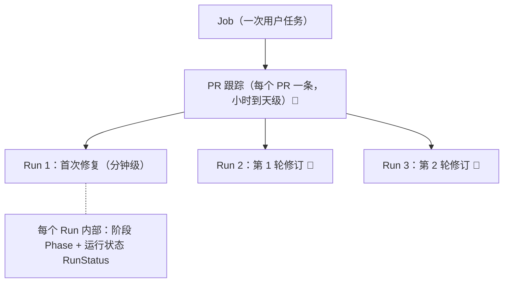
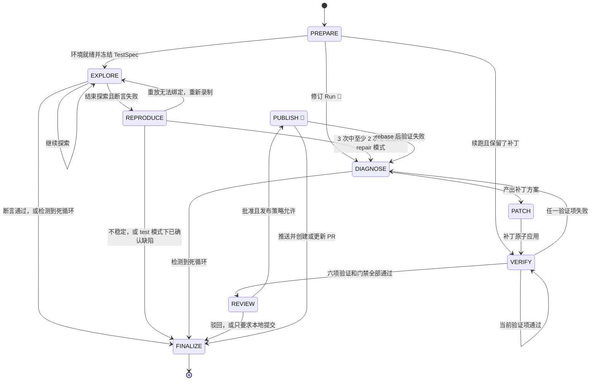
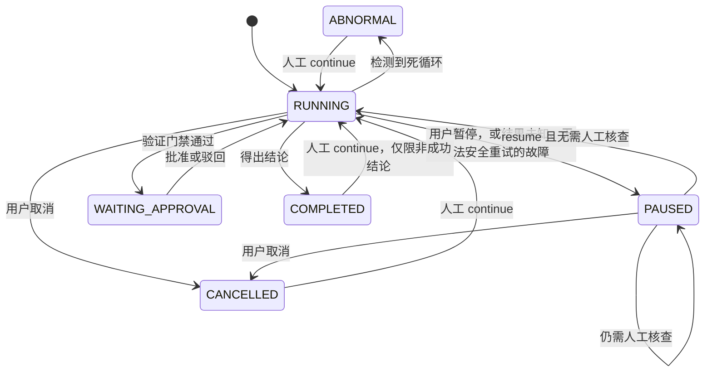
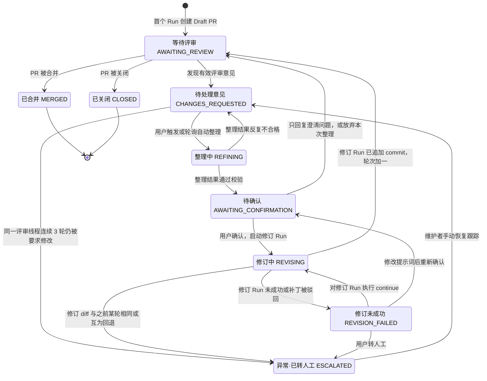

# 全周期状态流转

说明「测试 → 修复 → 提交代码 → 收到 PR 意见 → 再修复 → 再提交代码」全过程中 Agent 的状态，以及每一次状态转换的条件。「现状」部分附代码证据；标 📐 的是目标设计。

Run 累计用量不作为预算上限；检测到死循环时结果为 `LOOP_DETECTED`、状态为 `ABNORMAL`。这与单次模型交互防护分开：`max_attempts` 默认 3，`max_tool_rounds` 默认 40。目标设计希望其他故障通过反馈或暂停处理，但通用异常和门禁失败的全部改造尚未完成，不能将该目标描述为当前所有路径的行为。

## 0. 结论

**PR 提交后、评审人给出意见之前，Agent 处于什么状态？**

- 产生 PR 的那个 Run **进入终止状态**：`COMPLETED`，结果 `FIX_VERIFIED`，交付状态 `PUBLISHED`（📐 新增字段，见 2.4 节）。沙箱和浏览器全部释放。
- 等待评审的不是 Run，而是新增的 **PR 跟踪**（📐）。它处于非终止状态 `AWAITING_REVIEW`，只是数据库里的一条记录，不占用计算资源。
- 准确地说，这段时间**没有 Agent 在运行**，只有 PR 跟踪在等待。

不让 Run 挂起（`PAUSED` / `WAITING_APPROVAL`）等评审，原因有四个：

1. 评审可能要几小时到几天，这段时间 Agent 无事可做。让 Run 一直停在非终止状态，「运行中 / 暂停」就失去了意义，调度和监控也无法区分真正在工作的 Run。Run 旧时长预算已不作为限制，但这不解决长期占用资源的问题。
2. 现状要到 `finalize` 才关闭浏览器和沙箱（`engine.py:626-632`），挂起期间会一直占着容器。
3. 等待期间基线分支会变化，挂起时记录的环境摘要会过期，恢复时反正要重建环境。
4. 已发布的 commit 需要一条不可再改的审计记录。终止状态由 `reduce_state` 保证不可变更（`contracts.py:258-259`）。

**终止之后怎么再启动？**

- 不「恢复」原来的 Run，而是由 PR 跟踪**派生一个新的修订 Run**（`kind=review_revision`，`parent_run_id` 指向上一个 Run）。
- 启动方式默认是**人工确认**：

| 阶段 | 谁发现评审意见 | 谁启动修订 |
|---|---|---|
| M1 | 用户执行 `tracefix review <PR>`，或在 Web 上点击「按评审意见修复」 | 用户确认整理出的提示词后启动 |
| M5 起 | 轮询自动发现，并自动调用文本模型整理 | 仍需用户确认后启动（默认） |
| 可选 | 同上 | 仓库发布策略为 `auto-draft`，且整理结果中没有需澄清、拒绝、L3、冲突项时，自动启动 |

- 为什么不用现有的 `/continue`：
  - `can_continue` 拒绝结果为 `FIX_VERIFIED` 的 Run（`continuation.py:6-9`）。
  - 现有续跑沿用同一个 `run_id` 和 checkpoint 线程，在原工作区上继续（`continuation.py:22-32`、`cli/main.py:263-265`、`engine.py:682-694`）。它适合「修复失败后再试一次」，不适合「已发布之后按新要求再改」：修订的代码基线是 PR 分支的 head，而且上一个 Run 要作为已发布 commit 的审计记录保持不变。

## 1. 三层状态

| 层 | 状态存放 | 生命周期 | 现状 |
|---|---|---|---|
| Run 阶段（Phase） | `RunState.phase` | 分钟级 | ✅ 8 个阶段（`contracts.py:33-41`）；📐 新增 PUBLISH |
| Run 运行状态（RunStatus） | `RunState.run_status` | 分钟级；等待审批时可能更长 | ✅ `RUNNING / WAITING_APPROVAL / PAUSED / COMPLETED / CANCELLED / ABNORMAL`；`WAITING_INPUT` 已定义但未使用，`FAILED` 仍有兼容及异常收尾路径（`runtime/contracts.py:RunStatus`、`Engine.finalize`） |
| PR 跟踪 | 新表 `pull_request_tracks` | 从 PR 创建到合并或关闭 | 🔴 没有 PR，也没有这一层 |
| 评审意见整理 | `ReviewGuidance` 记录 | 一次整理 | 🔴 见 `PR评审意见驱动修复.md` |

## 2. 单个 Run 的状态机

### 2.1 阶段转换图

图为目标设计；与现状的差异见 2.2 节表格的「状态」列。

### 2.2 阶段转换条件

| # | 从 | 到 | 条件 | 状态 | 证据 |
|---|---|---|---|---|---|
| 1 | — | PREPARE | 新建 Run（首次任务，或 📐 修订 Run） | ✅ | `cli/main.py:287` |
| 2 | PREPARE | EXPLORE | 依次完成：沙箱启动与健康检查、源码清单一致、基线单测、首次只读导航、编译并冻结 TestSpec | ✅ | `engine.py:341-394` |
| 3 | PREPARE | VERIFY | 续跑，且 `continuation_count`、`patch_hash`、`reproduced`、`replay_plan_ref` 都存在（转移表之外唯一的例外） | ✅ | `engine.py:392`、`contracts.py:267-269` |
| 4 | PREPARE | DIAGNOSE | 修订 Run：继承父 Run 冻结的 TestSpec 和重放计划；需要在 `reduce_state` 中增加与第 3 行同类的例外 | 📐 | — |
| 5 | EXPLORE | EXPLORE | PydanticAI Agent 在原生工具决策内按宿主工具结果继续交互，直到最终 `finish` | ✅ | `PydanticAIAdapter.generate`、`Engine.explore_gate` |
| 6 | EXPLORE | REPRODUCE | 最终 `finish` 触发确定性检查，断言失败；重复动作本身不代替该检查 | ✅ | `Engine.explore_gate` |
| 7 | EXPLORE | FINALIZE | 确定性断言通过 → `NO_BUG_FOUND`；循环检测触发时以 `LOOP_DETECTED` 收尾 | ✅ | `Engine.explore_gate`、`Engine._mark_loop` |
| 8 | REPRODUCE | DIAGNOSE | 3 次重放中至少 2 次与首次失败签名一致，且 `mode=repair` | ✅ | `engine.py:487-491` |
| 9 | REPRODUCE | FINALIZE | 复现不稳定 → `INCONCLUSIVE`；test 模式下稳定复现 → `BUG_CONFIRMED` | ✅ | `Engine.reproduce` |
| 10 | DIAGNOSE | PATCH | 模型产出 `PatchProposal`，且引用的证据都存在 | ✅ | `engine.py:523-527` |
| 11 | DIAGNOSE | FINALIZE | 循环检测触发；累计补丁次数不是 Run 预算，不能与单次请求重试或工具轮次上限混淆 | ✅ | `Engine.prelude`、`Engine._loop_assessment` |
| 12 | PATCH | VERIFY | 补丁原子应用成功（进入 PATCH 的前提是已复现且源码对齐） | ✅ | `engine.py:530-544`、`contracts.py:270-271` |
| 13 | VERIFY | VERIFY | 当前验证项通过，还有下一项（static → unit → build → health → original → regression） | ✅ | `engine.py:550,582-583` |
| 14 | VERIFY | DIAGNOSE | 任一验证项失败 | ✅ | `engine.py:579-581` |
| 15 | VERIFY | REVIEW | 六项全部通过，且 `verification_gate` 通过 → 结果 `FIX_VERIFIED`，状态 `WAITING_APPROVAL` | ✅ | `engine.py:584-590` |
| 16 | VERIFY | FINALIZE | 六项都通过，但门禁拒绝证据 → `INFRA_FAILURE`。📐 改为从第一项重新验证，不再结束 Run | ✅ | `engine.py:585-586,304-310` |
| 17 | REVIEW | FINALIZE | 现状：批准 → 创建本地分支；驳回 → 不建分支，但结果仍为 `FIX_VERIFIED` | ✅ | `engine.py:592-608` |
| 18 | REVIEW | PUBLISH | 补丁已批准；发布策略为 `manual` 时还需要再批准一次发布，为 `auto-draft` 时直接发布 | 📐 | — |
| 19 | REVIEW | FINALIZE | 驳回 → 交付状态记为 `REJECTED`；或本次只要求本地提交 → `LOCAL_ONLY` | 📐 | — |
| 20 | PUBLISH | FINALIZE | 首次 Run：push 并创建 Draft PR；修订 Run：在同一 PR 分支追加 commit 并逐条回复评论 → 交付状态 `PUBLISHED` | 📐 | — |
| 21 | PUBLISH | DIAGNOSE | 基线分支已前进，rebase 后重跑 original + regression 验证失败 | 📐 | — |
| 22 | PUBLISH | （PAUSED） | push 或创建 PR 的结果未知；分支保护、权限不足需要人工处理 | 📐 | 沿用 `engine.py:272-279` 的结果未知语义 |
| 23 | 任意 | 原阶段重试或 FINALIZE | 模型输出和明确策略错误已反馈重新决策；其他异常在已提交实现中仍可能以 `INFRA_FAILURE` 收尾。📐 通用异常改为暂停尚非本次已完成内容 | ✅ / 📐 | `Engine._graph` |
| 24 | 任意 | FINALIZE | 循环检测判定为循环 → `LOOP_DETECTED` / `ABNORMAL`；模型/MCP 的 `UNKNOWN_OPERATION`、`WAITING_NETWORK` 优先转暂停，不能被循环终止覆盖 | ✅ | `Engine._graph`、`Engine.model_call` |
| 25 | REPRODUCE | EXPLORE | 重放无法绑定时重新录制计划，TestSpec 保持冻结；按键重放先绑定当前 observation，缺少有效观测也不能直接执行 | ✅ | `Engine.act`、`Engine._graph` |

📐 转移表增量：`REVIEW → {PUBLISH, FINALIZE}`，`PUBLISH → {FINALIZE, DIAGNOSE}`；`PREPARE → DIAGNOSE` 只对修订 Run 开放。`REPRODUCE → EXPLORE` 的重录路径已存在。

#### 浏览器交互对阶段状态的影响 ✅

LangGraph 主图负责阶段转移，节点内模型执行经 `Gateway` 兼容接口进入 `PydanticAIAdapter`。默认 native 模式由 PydanticAI Agent 在 `decide` 内完成多轮受限浏览器工具往返，实际执行只经过宿主端口与 TraceFix policy、operation receipt、MCP；收到新 observation 后刷新上下文、规则/Skill、重放计划与审计。框架不写 RunState，也不代替 checkpoint、interrupt、审批、UNKNOWN/resource fence 或证据验证。

最终 `Decision.action.kind` 必须为 `finish`，再由 `execute → explore_gate` 判定结果。工具成功、模型自报完成和截图引用都不等于测试通过；源码/补丁/环境绑定、验证门和独立 Oracle 继续由宿主负责。

浏览器交互统一使用 PydanticAI 的原生工具调用，不再提供工具模式开关或 JSON 单动作路径。`TestSpec` / `PatchProposal` 保持现有类型化契约。默认不向模型发送图片，未配置视觉模型时仍保存截图证据。工具参数与消息配对见[工具调用与 Skill](工具调用与Skill.md)。

### 2.3 运行状态（RunStatus）

图为目标设计：循环退出的 `ABNORMAL` 已实现，完全去除遗留 `FAILED` 收尾分支仍属后续整理。

| 从 | 到 | 条件 | 证据 |
|---|---|---|---|
| RUNNING | PAUSED | `/pause`、`/interrupt`，在下一个安全边界 `prelude` 生效 | `cli/main.py:470,545`、`engine.py:330-333` |
| RUNNING | PAUSED | 副作用结果未知（`UnknownOperation`） | `engine.py:272-279` |
| RUNNING | PAUSED | 模型或 MCP 返回 `WAITING_NETWORK` / `UNKNOWN_OPERATION`；这些状态优先于循环检测，且不得自行重放未知副作用 | `Engine._graph` |
| PAUSED | RUNNING | `/resume` 且无需人工核查；确定未发送的模型请求保留恢复元数据，并按 schema + `logical_exchange_id` 恢复消息；只能在同一进程中恢复 | `Engine.paused`、`Engine.model_call` |
| PAUSED | PAUSED | 仍需人工核查或新 Run 的浏览器/模型状态；已有 intent 无 receipt 时也不得重放 | `Engine.paused`、`Engine.operation` |
| RUNNING | WAITING_APPROVAL | 验证门禁通过 | `engine.py:589` |
| WAITING_APPROVAL | RUNNING | `/approve` 或 `/reject`；可以跨进程恢复，因为审批只使用冻结的证据 | `engine.py:600-607`、`cli/main.py:382-393` |
| RUNNING、PAUSED | 终止 | `finalize` 计算：用户取消 → `CANCELLED`；循环退出 → `ABNORMAL`；仍保留部分历史异常的 `FAILED` 分支；正常结论 → `COMPLETED` | `Engine.finalize` |
| RUNNING、PAUSED | 终止 | 📐 终止状态只剩三种：用户取消 → `CANCELLED`；检测到死循环 → `ABNORMAL`（结果 `LOOP_DETECTED`）；得出结论（`FIX_VERIFIED`、`NO_BUG_FOUND`、`BUG_CONFIRMED`、`INCONCLUSIVE`）→ `COMPLETED` | 开发计划 3.6 节 |
| 终止 | RUNNING | `/continue`：沿用同一个 `run_id`，`revision` 和 `continuation_count` 加一；只允许非成功结束的 Run，`FIX_VERIFIED`、`NO_BUG_FOUND` 不能续跑。📐 `ABNORMAL` 的 Run 可以续跑，循环证据会注入续跑的上下文；续跑不再追加预算 | `continuation.py:6-32` |

输出校正与 Run 恢复必须区分：`max_attempts` 默认 3，映射为 PydanticAI 首次输出后的两次校正机会，不提供网络重试。明确 `not_sent` 的连接故障由宿主判断可安全恢复；已发请求断流、读取结果未知或未知副作用进入核查，取消向外传播。恢复历史保留 assistant/tool 配对、原始 `tool_call_id`、receipt 与供应商 reasoning；默认 40 个工具轮次包含历史轮次，同 ID/参数的已完成调用复用结果。每次实际 provider 请求都有预算清单和 request/response/error 审计，已知 usage 逐次计量，不只统计最终响应。

📐 等待审批期间释放资源：进入 `WAITING_APPROVAL` 超过 10 分钟后，释放浏览器和应用容器。审批只使用冻结的证据，PUBLISH 只需要 git 工作区。审批超过 24 小时未处理时提醒负责人，不自动驳回。

### 2.4 交付状态（📐 新增字段 `delivery`）

现状被驳回的 Run 结果仍是 `FIX_VERIFIED`（`engine.py:600-607`），和「已修复并交付」区分不开。新增 `RunState.delivery` 字段：

| 值 | 含义 | 写入时机 |
|---|---|---|
| `NONE` | 没有进入审批（未修复、未复现等） | 默认 |
| `LOCAL_ONLY` | 已批准，只创建了本地分支（现状行为） | REVIEW 批准且不发布 |
| `REJECTED` | 补丁被驳回 | REVIEW 驳回 |
| `PUBLISHED` | 已推送到 PR | PUBLISH 成功 |

## 3. PR 跟踪状态机（📐 新增）

| 从 | 到 | 条件 |
|---|---|---|
| — | AWAITING_REVIEW | 首个 Run 在 PUBLISH 阶段成功创建 Draft PR |
| AWAITING_REVIEW | AWAITING_REVIEW | 没有新的有效意见。M5 起每 2 分钟轮询一次，7 天无活动后改为每 30 分钟一次；只降低频率，不改变状态 |
| AWAITING_REVIEW | CHANGES_REQUESTED | 发现有效评审意见，即有写权限的成员或被指派的 reviewer 给出了以下任意一种：`CHANGES_REQUESTED` 评审、未解决的行内评论、`/tracefix fix` 指令。M1 在用户执行命令或打开 PR 页时拉取；M5 起由轮询发现。`APPROVED` 评审、无写权限者的评论不会触发 |
| CHANGES_REQUESTED | REFINING | M1：用户执行 `tracefix review` 或点击「按评审意见修复」；M5 起轮询发现后自动进入 |
| CHANGES_REQUESTED | ESCALATED | 跨轮循环：同一评审线程连续 3 轮修订后仍被要求修改（连续 2 轮时先预警）。PR 跟踪标记为异常，在 PR 上留言说明，并通知负责人。不设修订轮数上限，其他线程上的新意见照常处理 |
| REFINING | AWAITING_CONFIRMATION | 文本模型输出的 `ReviewGuidance` 通过确定性校验 |
| REFINING | CHANGES_REQUESTED | 校验错误反馈给模型后，同一错误仍反复出现（死循环检测的「错误重复」信号）；或校验结果为「不完整」。通知用户重试或手写提示词 |
| AWAITING_CONFIRMATION | REVISING | 用户确认；或仓库允许自动执行，且没有需澄清、拒绝、L3、冲突项。同时创建修订 Run |
| AWAITING_CONFIRMATION | AWAITING_REVIEW | 用户只把澄清问题回复给评审人，或放弃本次整理；评审人回复后重新进入 CHANGES_REQUESTED |
| REVISING | AWAITING_REVIEW | 修订 Run 的交付状态为 `PUBLISHED`：已追加 commit、已逐条回复评论；修订轮次加一 |
| REVISING | ESCALATED | 跨轮循环：修订 Run 的 diff 与之前某一轮相同，或互为回退（在 PUBLISH 前检查，不推送） |
| REVISING | REVISION_FAILED | 修订 Run 以非成功结果结束（包括因死循环以 `ABNORMAL` 结束），或交付状态为 `REJECTED` |
| REVISION_FAILED | REVISING | 用户对修订 Run 执行 `/continue`（非成功结束的 Run 可以用现有续跑） |
| REVISION_FAILED | AWAITING_CONFIRMATION | 用户修改提示词后重新确认，创建新的修订 Run |
| REVISION_FAILED | ESCALATED | 用户选择转人工 |
| ESCALATED | CHANGES_REQUESTED | 维护者手动恢复跟踪（`tracefix review <PR> --resume`） |
| 任意非终止状态 | MERGED / CLOSED | PR 被合并或关闭。如有正在运行的修订 Run，先取消 |

补充规则：

- 修订 Run 运行期间出现的新评论不打断当前修订，先标记为待处理；修订完成回到 AWAITING_REVIEW 后，立即再进入 CHANGES_REQUESTED。
- 同一个 PR 同一时间最多只有一个修订 Run。

## 4. 全流程时间线

| # | 事件 | Run #1 | Run #2（修订） | PR 跟踪 | 有 Agent 在运行？ | 触发方 |
|---|---|---|---|---|---|---|
| 1 | 用户发起任务 | PREPARE · RUNNING | — | — | 是 | 用户 |
| 2 | 探索、复现 | EXPLORE → REPRODUCE · RUNNING | — | — | 是 | 自动 |
| 3 | 诊断、补丁、验证 | DIAGNOSE → PATCH → VERIFY · RUNNING | — | — | 是 | 自动 |
| 4 | 等待补丁审批 | REVIEW · WAITING_APPROVAL | — | — | 否（10 分钟后释放容器） | 等待用户 |
| 5 | 批准并发布 | PUBLISH · RUNNING | — | 创建 → AWAITING_REVIEW | 是 | 用户批准 |
| 6 | 发布完成 | FINALIZE → COMPLETED（FIX_VERIFIED，PUBLISHED） | — | AWAITING_REVIEW | **否** | — |
| 7 | 评审人提出意见 | 终止，不变 | — | CHANGES_REQUESTED | 否 | 评审人 |
| 8 | 整理评审意见 | — | — | REFINING → AWAITING_CONFIRMATION | 只调用一次文本模型 | M1 用户；M5 轮询 |
| 9 | 用户确认提示词 | — | PREPARE · RUNNING | REVISING | 是 | 用户 |
| 10 | 修订、验证 | — | DIAGNOSE → PATCH → VERIFY · RUNNING | REVISING | 是 | 自动 |
| 11 | 等待补丁审批 | — | REVIEW · WAITING_APPROVAL | REVISING | 否 | 等待用户 |
| 12 | 批准并追加 commit | — | PUBLISH → FINALIZE → COMPLETED（PUBLISHED） | AWAITING_REVIEW（第 1 轮） | 是，结束后否 | 用户批准 |
| 13 | 评审通过并合并 | — | — | MERGED | 否 | 评审人 |

第 7 步到第 13 步之间，评审人可能多次提出意见；每一轮都重复第 7 步到第 12 步，不限轮数。出现跨轮循环时，PR 跟踪进入 `ESCALATED`（异常，已转人工）。

## 5. 需要的改动（📐）

| 改动 | 位置 | 工作包 |
|---|---|---|
| 新增 `Phase.PUBLISH` 与转移表增量 | `runtime/contracts.py` | W-04 |
| 新增 `RunState.delivery`，修正「驳回仍是 FIX_VERIFIED」的歧义 | `contracts.py`、`engine.py:592-608` | W-04 |
| 新增 `RunState.kind`（`repair` / `review_revision`）和 `parent_run_id`；在 `reduce_state` 中为修订 Run 开放 `PREPARE → DIAGNOSE` | `contracts.py:255-275` | W-28 |
| 新增 PR 跟踪实体（表 `pull_request_tracks`：仓库、PR 编号、head 分支、状态、修订轮次、待处理评论 id、ETag、关联 Run 列表） | `storage/schema.sql` | W-28 |
| 等待审批超过 10 分钟后释放容器 | `engine.py`、`execution/runner.py` | W-04 |
| M5 轮询器驱动 PR 跟踪的状态转换 | 新增 | W-26 |
| 在已实现 Run 用量计量、循环检测、工具安全重试与重录路径基础上，完成通用异常/门禁恢复与 PR 跟踪跨轮循环；保留单次模型交互防护 | `contracts.py`、`engine.py`、`continuation.py`、`worker.py`、`context.py`、`gateway.py` | W-29 |
| `WAITING_INPUT`（已定义未使用）：删除，或用于 L3 改目标等待用户确认 | `contracts.py:46` | W-07 |
