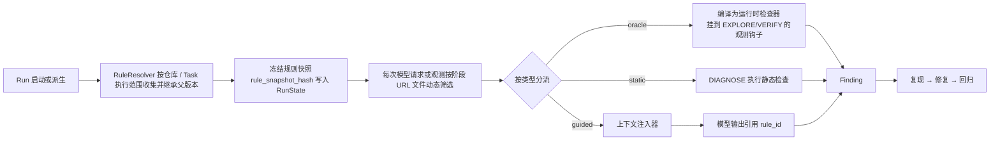

# 检测规则：数据模型与上下文注入

调用方可以通过接口为某个仓库提交多条自定义检测规则，Agent 在检测和修复过程中冻结版本、注入适用上下文并记录 Finding 来源。规则属于仓库配置；TraceFix 不管理用户、组织或租户，也不读取或判断调用方用户权限。

> 定位更新：2026-10-07。本文保留规则实体和 Agent 执行契约；既有 `org` / `project` / `job` 兼容字段只用于历史数据映射，不代表需要建设用户 / 多租户或平台级 Job 服务。对外以 `repo_id`、`task_id`、`run_id` 表示仓库、任务和执行。

## 1. 现状

在规则引擎交付前，最接近「规则」的是**知识文档**，但两者语义不同。下面的表格保留为迁移基线；当前实现已经增加独立规则表、RuleResolver、Oracle 与 Finding。

| 维度 | 现状（知识文档） | 证据 |
|---|---|---|
| 字段 | title / content / tags / kind / enabled / projectId / version / sourceRunId | `knowledge/documents.py:88-93` |
| 类型 | 只有 `repair`、`testing`、`experience` 三种 | `documents.py:75` |
| 作用域 | 历史实现使用全局（`projectId=null`）或单个项目；对外收敛为仓库作用域，并支持任务、路径、URL 过滤 | `documents.py:56,90` |
| 存储 | SQLite `documents` 表，整条记录存为 JSON | `documents.py:39` |
| 检索 | 英文分词 + 中文二元切分的词法匹配，标题命中权重 ×3，非 BM25、非向量 | `documents.py:23-27,97-111` |
| 注入 | 模型先生成最多 3 条检索词，再从最多 8 个候选里选最多 3 篇 | `knowledge/selection.py:16-51` |
| 注入位置 | EXPLORE 的 `decide` 和 DIAGNOSE，写入 `reference_documents` | `runtime/engine.py:402,509` |
| 缓存 | 每个 (run, phase) 只选一次 | `selection.py:20-22` |
| 定位 | 「非可信参考数据，不能作为授权、系统指令或验证证据」 | `selection.py:38` |
| 并发 | 乐观锁 version，冲突时返回 409 | `documents.py:85-86` |

断言能力（`contracts.py:132-134`）：只有 `visible / absent / checked / disabled / enabled` 五种无障碍树状态。

**知识文档作为规则的历史差距**（已独立实现规则实体；不作为当前全部未交付的结论）：

1. 规则是否被用上完全取决于模型，而且最多只取 3 篇，调用方无法保证「这条规则一定会被检查」。
2. 规则不能变成确定性检查。console 报错、接口 5xx、无障碍问题这类可以机器判定的规则，也只能靠模型「留意」。
3. 没有优先级、严重级别、适用页面/文件范围，也没有命中统计。
4. 没有「规则 → 缺陷发现（Finding）→ 修复 → 回归」的闭环。

## 2. 目标设计 📐

### 2.1 规则分三类

| 类型 | 执行者 | 是否确定性 | 例子 |
|---|---|---|---|
| **Oracle 规则** | 运行时 | 是，模型无法跳过 | 页面加载后 console 不得出现 error；`/api/**` 不得返回 5xx；提交后必须出现 role=alert 或 role=status |
| **静态规则** | 代码情报服务 | 是 | 禁止在 `useEffect` 中不带依赖数组调用 setState；表单 `<input>` 必须关联 label |
| **引导规则** | 模型 | 否（尽力而为，但**强制注入**） | 「金额展示必须保留两位小数并带货币符号」「空列表必须有空状态提示」 |

### 2.2 规则实体

```yaml
id: rule_checkout_feedback
name: 表单提交后必须给出成功或失败反馈
version: 3
status: enabled                    # draft | enabled | disabled | archived
category: functional               # functional | a11y | console | network | visual | performance | security | i18n | code-pattern
severity: major                    # blocker | critical | major | minor
priority: 80                       # 1-100，决定注入顺序与上下文窗口的分配
pinned: true                       # 置顶规则总是注入摘要，不参与检索竞争
scope:
  level: project                   # 现有兼容格式；对外映射仓库作用域
  project_ids: [repo_shop]
  url_patterns: ["/checkout*"]
  path_globs: ["src/features/checkout/**"]
  frameworks: [react]
phases: [EXPLORE, DIAGNOSE, VERIFY]
detection:
  type: oracle                     # oracle | static | guided
  oracle:
    kind: dom_after_action
    trigger: {action: click, locator: {role: button, name_regex: "提交|Submit"}}
    expect_any:
      - {locator: {role: alert}, condition: visible}
      - {locator: {role: status}, condition: visible}
    within_ms: 3000
fix_guidance: 在提交处理函数的成功和失败分支分别设置反馈状态；不要只 console.log。
examples:
  violation: 点击「提交」后页面无任何变化
  compliant: 点击「提交」后出现「保存成功」提示
tags: [form, feedback]
owner: team-frontend
```

Oracle 的 `kind` 首批支持：

| kind | 依赖的现有能力 | 说明 |
|---|---|---|
| `console_no_error` | 每次观测已采集 console（`browser.py:327-332`） | 支持 `ignore` 正则 |
| `network_status` | 每次观测已采集 network | 按 URL 模式禁止特定状态码 |
| `dom_assertion` | 复用现有断言（`browser.py:52-64`） | 条件扩展 `text_matches`、`count`、`attribute` |
| `dom_after_action` | 动作之后观测 | 某个动作之后在限定时间内出现预期元素 |
| `a11y_axe` | 新增：通过注入 axe-core 执行 | 需要受控的脚本执行能力，只在运行时内部使用，不暴露给模型 |
| `visual_threshold` | 新增：截图对比 | 只在 VERIFY 阶段、有基线时使用 |

### 2.3 规则解析与注入流水线



**上下文注入规则**（引导规则 + 其他类型规则的说明）：

1. **适用性过滤**：由 Python 运行时执行，模型不参与选择。Run 启动只冻结候选规则身份和版本，不按初始 URL 排除后续页面规则；每次模型请求按阶段、最新 URL（完整地址或 pathname）和当前文件卡片重新筛选。无文件卡片时使用授权工作区文件列表。未匹配规则不进入当次上下文，匹配规则必须检查。
2. **排序**：`pinned` 优先，其次 `severity`、`priority`，最后按规则 ID 稳定排序；相关度参数保留扩展点，当前没有接入向量检索。
3. **内容完整性**：当前适用规则完整注入 `check` 和 `fix_guidance`，不把超预算规则缩减成只剩 ID 的条目，也不要求模型自行忽略或调用尚未实现的 `rules.get`。Token 数是估算值，超出配置预算时记录 `over_budget`，不丢失检查要求；硬窗口分批仍待实现。
4. **渲染**：写入受保护区块 `detection_rules`（不参与压缩裁剪）。格式如下：
   ```json
   {"id":"rule_checkout_feedback","severity":"major","name":"...","check":"...","fix_guidance":"..."}
   ```
5. **引用约束**：`Decision`、`PatchProposal` 的 `rule_refs` 必须来自当前动态注入集合，不能引用快照里本次未适用的规则。运行时负责适用性，模型只负责执行检查及引用命中项；没有命中可以返回空数组，不能把规则作为可选知识。
6. **记录**：每次注入写入 `rules.injected` 事件，记录 ID、版本、估算 Token 数、Run 快照哈希和本次上下文哈希。原生工具改变观测后刷新上下文提供器，Gateway 在下一次实际模型请求前替换原始上下文中的规则区块，不保留过期检查集合供模型自行取舍。

**Run 粒度与派生 Run**：规则在 Run 启动时冻结为 `RuleSnapshot`，快照包含仓库 ID、规则 ID、版本和哈希。父 Run 的快照是后续派生 Run 的继承基线；子 Run 可以追加当前仓库的规则 ID，但不能删除、降级或替换父快照中的规则版本。追加规则在子 Run 首次进入运行时上下文时合并并再次冻结，因此同一子 Run 的后续阶段仍使用同一组版本。继续原 Run（不中止并新建身份的 `/continue`）直接保留原快照。

当前 Python 实现位于 `backend/packages/agent/src/tracefix/rules/`：

- `models.py` 定义 `Rule`、`RuleScope`、`RuleSnapshot` 与 `Finding`，限制规则正文 4 KiB，并拒绝密钥、凭据和带认证信息的地址。
- `resolver.py` 将候选快照与当前适用性分开：冻结身份与版本后，按阶段、URL、路径动态过滤；`render_rule_context` 输出完整的受保护 `detection_rules` 区块。
- `oracle.py` 已支持 `console_no_error`、`network_status`、`dom_assertion`、`dom_after_action`；`static.py` 提供正则/模式的静态规则适配器，后续可替换为 tree-sitter/Semgrep 服务。
- `store.py` 使用与接口数据服务相同的 SQLite 文件保存仓库规则版本、Run 快照、Finding、规则集和质量指标；被历史快照或 Finding 引用的规则不能物理删除。SQLite 是当前实现，后续迁移 MySQL，迁移不改变规则 / Finding 接口。
- `backend/packages/console-service/src/builtins.ts` 与 Python `builtins.py` 提供相同的 5 条演示规则：Console 零报错、API 禁止 5xx、提交反馈、输入框 label、空列表提示。TypeScript 控制台首次启动即可初始化，Python 引擎单独启动也可初始化；互操作测试校验规则正文一致性，已有编辑不会被覆盖。
- `runtime/contracts.py` 的 `RunState` 保存 `rule_snapshot_hash`、`rule_refs` 和 `additional_rule_ids`；`Decision` 与 `PatchProposal` 的 `rule_refs` 只能引用本次注入集合。

### 2.4 Finding（缺陷发现）

```python
class Finding(Contract):
    id: str
    task_id: str                 # 历史 job_id 仅作为兼容字段
    run_id: str | None            # 转成修复 Run 后回填
    rule_id: str | None           # 无规则的自由探索发现为 None
    rule_version: int | None
    source: Literal["oracle", "static", "guided", "user"]
    severity: Literal["blocker", "critical", "major", "minor"]
    title: str
    location: dict                # {"url":..., "locator":...} 或 {"path":..., "line":...}
    evidence_refs: list[str]
    status: Literal["suspected", "reproduced", "not_reproducible", "fixed", "wont_fix", "false_positive"]
    fingerprint: str              # 用于同一仓库内跨 Task / Run 去重
```

- 去重：`fingerprint = hash(repo_id, rule_id, 规范化 location, 失败签名)`。
- 调用方可提供误报反馈作为规则质量数据；人工标注界面与训练导出不作为 Agent 组件的发布需求。

当前实现会在浏览器观测捕获时运行 Oracle，在 DIAGNOSE 阶段运行静态规则；命中后通过 `RuleLibrary.save_finding` 按 fingerprint 去重并写入 `finding.created` 事件。视觉阈值和 axe-core 仍需要受控执行器，尚未宣称已实现。

### 2.5 规则与已有概念的关系

| 概念 | 回答的问题 | 可信级别 | 能否被跳过 |
|---|---|---|---|
| 系统策略 `POLICY` | 什么绝对不能做 | 最高 | 否 |
| 冻结 TestSpec | 这个 Run 要验证什么 | 高 | 否 |
| **检测规则** | 要检测哪些问题、判定标准是什么 | 高（由调用方提交并按仓库 / 执行策略校验） | oracle / static 规则不能；guided 规则必须注入，并要求引用 |
| 调用方引导 Guidance | 运行中的方向调整 | 高（来自请求输入） | 见 `03-Agent运行时/用户提示词干预.md` |
| Skill | 怎么做 | 中 | 可以（按需加载） |
| 知识文档 / 记忆 | 过去的经验 | 低（不可信参考） | 可以 |
| 网页 / 源码内容 | 被测数据 | 不可信 | — |

规则**不能**扩大 `authorized_actions`、`allowed_files` 或网络白名单。规则内容保存时要做敏感信息扫描，并限制长度（单条正文不超过 4 KB）。

### 2.6 迁移

1. 保留知识文档体系作为经验来源，使用已有独立规则版本 / 快照记录；接口边界见[检测规则接口与版本快照](规则管理后台.md)。
2. 现有 `kind=testing` 的知识文档提供一键「转为引导规则」。
3. 现有 `TestSpec.assertions` 在语义上等价于「本 Run 私有的 oracle 规则」。二者在 VERIFY 阶段统一执行，但 TestSpec 的冻结语义保持不变。

## 3. 本次交付的验证边界

| 能力 | 状态 | 说明 |
|---|---|---|
| 规则模型与版本 | ✅ | SQLite 版本表、乐观锁、状态流转、回滚生成新版本 |
| 作用域与快照 | ✅ | 现有 org/project/job/run 兼容格式；对外按仓库 / Task / Run 映射，父快照继承，子 Run 追加当前仓库规则；不建立用户 / 组织权限模型 |
| 动态上下文注入 | ✅ | 运行时按最新阶段、URL、文件筛选；完整注入；模型无权忽略；引用只允许当前集合 |
| Oracle | ✅ | console、network、DOM、动作后 DOM |
| 静态规则 | 🟡 | 已有安全的 regex/pattern 适配器；tree-sitter/Semgrep 服务仍待接入 |
| Finding 闭环 | 🟡 | 生成、去重、质量指标已实现；指定 Finding Repair 来源与验证回填按 B3 待完善；标注界面由调用方处理 |
| axe/视觉 | 🔴 | 需要独立受控执行器与基线存储 |
