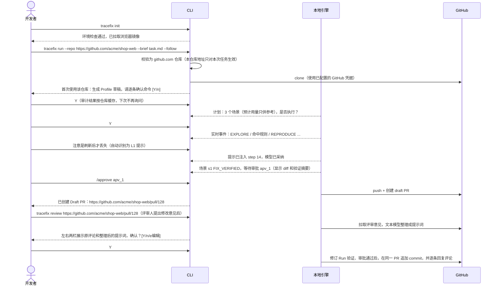

# 端到端用户流程

## 1. 用户角色

| 角色 | 典型诉求 | 主要入口 |
|---|---|---|
| 个人开发者 | 在本机对自己的仓库做 GUI 测试和修复，得到 PR | CLI（+ 本地 Web） |
| 团队开发者 / QA | 对团队仓库派发检测修复任务，审阅补丁 | Web |
| 项目维护者 | 配置仓库 Profile、规则集、发布策略 | Web |
| 组织管理员 | 成员、角色、用量统计、组织级规则、审计 | Web |
| 数据 / 算法工程师 | 筛选轨迹、标注、构建数据集、跑评测 | Web + CLI |

## 2. 现状可走通的流程

```text
CLI：/remote set --scope session（按会话配置仓库）→ 输入目标 → /run → 观察 → /approve → 本地分支 tracefix/run_*（结束）
Web：只能选择已注册的本地项目 → 启动 Test/Repair → 查看进度 → 审批必须切换到 CLI（结束）
```

「输入仓库地址 → 看到 PR 链接」目前两个入口都走不通：

- 缺少 push / PR。
- CLI 虽然能按会话配置 github.com 仓库，但 clone 不处理认证，私有仓库依赖本机已配置的 git 凭据（`remote.py:108-111`）；会话配置也只替换代码目录，Profile 仍来自已注册项目。
- Web 端没有仓库配置入口。

## 3. 目标流程 📐

### 3.1 旅程 A：个人开发者（CLI）



### 3.2 旅程 B：团队开发者（Web）

| 步骤 | 页面 | 用户操作 | 系统反馈 |
|---|---|---|---|
| 1 | `/login` | SSO 登录 | 进入工作台 |
| 2 | `/jobs/new` 第 1 步 | 直接填写 GitHub 仓库地址 `https://github.com/acme/shop-web` 和基线分支（只对本任务生效） | 校验是 github.com 仓库且 GitHub App 已安装；查到已审计的 Profile 就直接复用，否则自动探测生成草稿 |
| 3 | `/jobs/new` 第 1 步（仅首次） | 逐条确认命令 →「构建镜像」→「运行冒烟检查」；可勾选「保存为仓库默认设置」 | Profile 标记为「可用」，并按仓库缓存 |
| 4 | `/jobs/new` 第 3 步 | 选择「电商结账基线」规则集 | — |
| 5 | `/jobs/new` | 完成其余步骤 →「生成计划」→ 勾选场景 →「启动」 | 跳转到任务详情 |
| 6 | `/jobs/:id` | 观察看板：Finding 逐个出现并转为 Run | 通知：发现 2 个 major 缺陷 |
| 7 | `/runs/:id` | 在右侧面板发送「不要改 src/legacy」（约束） | 约束已生效，出现在状态条中 |
| 8 | `/runs/:id` | 审批卡片弹出 → 查看 diff、验证、截图 →「批准补丁」 | 自动创建 draft PR（发布策略为 auto-draft） |
| 9 | GitHub | 评审人在 PR 中评论「文案应改为『已保存』」 | 任务负责人收到通知（M1 手动点击「按评审意见修复」；M5 起由轮询自动发现） |
| 10 | `/reviews/:id` | 核对原评论与文本模型整理出的提示词，必要时编辑 →「确认并启动修订」 | 修订 Run 通过验证和审批后，在同一 PR 追加 commit，并在评论下回复处理结果 |
| 11 | `/jobs/:id` | 「导出报告」 | 中文 HTML 报告 |

### 3.3 旅程 C：项目维护者 / 管理员（规则）

1. `/rules` →「从模板创建」→ 选择「提交后必须有反馈」→ 在编辑器中用可视化构建器修改 oracle 条件。
2. 「试运行」→ 选择一个历史 Run 回放 → 看到它会命中第 7 步。
3. 保存为草稿 → 提交发布申请 → 另一名管理员审批 → 规则状态变为 enabled。
4. `/rules/insights` 查看规则一周后的命中率、误报率；根据用户标注的误报修订规则。

### 3.4 旅程 D：数据工程师

1. `/traces` 筛选：结果为 `FIX_VERIFIED`、近 30 天、`training_authorized` 的项目。
2. 抽样查看 Step，给推理质量打标签，修正错误步。
3. `/datasets` →「新建构建」→ 选择样本类型 `sft.agentic` + 过滤器 → 生成版本 `2026.10.1`。
4. CLI：`tracefix evals run --model student@v3` → 在 `/evals` 对比学生模型与教师模型。

### 3.5 旅程 E：自动触发（GitHub 集成）

内网部署收不到 github.com 的 Webhook，下列触发先由轮询发现，延迟为分钟级；以后有公网入口时再切换为 Webhook（见 `02-仓库交付流水线/GitHub接入与合并请求.md` 2.6 节）。

| 触发 | 行为 |
|---|---|
| Issue 被打上 `tracefix` 标签 | 用 Issue 正文作为任务说明创建 Job，结果以评论形式回写到 Issue |
| PR 评论 `/tracefix test` | 对 PR 的 head 分支跑 test 模式，把 Finding 以评论形式回写 |
| TraceFix 发起的 PR 收到评审评论 | 生成评审意见整理结果，通知任务负责人确认后启动修订 Run（见 `03-Agent运行时/PR评审意见驱动修复.md`） |
| 定时任务（夜间） | 按规则集对默认分支做回归检测 |

## 4. 人工审批点

本表合并当前能力与 📐目标流程；本地补丁审批和未知操作暂停已有实现，计划确认、发布策略和评审确认等仍按第 3 节规划，不能视为当前可用入口。

| 审批点 | 默认 | 可配置 | 说明 |
|---|---|---|---|
| Profile 命令审计 | 必须 | 否 | 首次接入或命令变更时 |
| 执行计划确认 | 开启 | 可在个人模式关闭（`--yes`） | 确认拆解出的场景符合预期 |
| L3 改目标 | 必须 | 否 | 需要重新冻结 TestSpec |
| 补丁审批 | 必须 | 否 | 与 `patch_hash` 绑定（现状已实现） |
| 发布审批 | manual | 可改为 auto-draft | auto-ready 仅限组织管理员开启 |
| 评审意见提示词确认 | 必须 | 发布策略为 auto-draft 的仓库可以改为自动；存在需澄清、拒绝、L3 或冲突项时仍需确认 | 并排展示原评论与文本模型整理出的提示词 |
| 结果未知的操作核查 | 必须 | 否 | `UNKNOWN_OPERATION`（现状已实现） |

## 5. 异常流程

| 场景 | 系统行为 | 用户可选操作 |
|---|---|---|
| 3 次试验中复现不足 2 次 | Run 结束，结果为 `INCONCLUSIVE`，并附复现记录 | 追加提示后执行 `/continue`；或标记为「不可复现」 |
| 疑似循环（预警） | 在下一次模型调用中注入「检测到重复」提示，要求换一种做法；推送通知，并在状态条中高亮。Run 继续 | 追加提示，或暂停 |
| 检测到死循环 | Run 退出，结果 `LOOP_DETECTED`，状态标记为异常；附循环证据（重复的步骤、补丁或错误）。结果未知或等待网络恢复优先暂停，不以循环判定覆盖其状态 | 查看证据后追加提示执行 `/continue`（循环证据会注入续跑上下文）；或取消 |
| 策略拦截 | 拒绝该动作，把原因反馈给模型重新决策，Run 继续；同一违规反复出现时判定为循环 | 确实需要放宽时，调整 Profile 白名单（需要维护者权限） |
| 需要人工核查 | `PAUSED`，显示结果未知的操作或无法安全重试的故障；当前直接恢复会被阻止 | 核对外部状态后取消当前 Run；如仍需执行，建立新的 Run，不能直接重放未知动作 |
| 发布冲突（base 已前进，📐规划） | 规划在发布能力实现后 rebase 并重跑验证；仍有冲突时生成续跑 Run | 批准续跑 / 手动处理 |
| 模型服务或基础设施故障 | 可安全重试的请求按退避间隔重试；已发送但结果未知的模型请求、已派发但回执未知的工具动作转 `PAUSED`，不得自动重放；未发送且明确标记 `WAITING_NETWORK` 的模型请求可在用户恢复后续接原消息 | 等待服务恢复后恢复该 Run；需要人工核查的状态只能核对后取消或新建 Run，不自动切换备用模型 |

当前不因 Run 总预算、补丁次数或累计时长耗尽而结束；单次请求仍有输出 token 限额和超时，Gateway 默认每轮最多尝试 3 次、一次 native 交互最多 8 个工具轮次，这些不等于 Run 累计预算。`UNKNOWN_OPERATION` 表示外部结果未知，当前阻止直接恢复，须先核查外部状态。只有模型请求为 `WAITING_NETWORK` 且 `request_status=not_sent`、`requires_manual_review=false`、`requires_new_run=false` 时，才允许用户恢复同一 Run。恢复时按失败的 `logical_exchange_id` 和 schema 续接已审计的消息及工具结果，不重复执行已完成动作；MCP 连接失效不能套用这一模型请求恢复条件。详见 [主循环与状态机](../03-Agent运行时/主循环与状态机.md)。

## 6. 配置与模型协议

当前默认使用 DeepSeek 类 Chat Completions：`TRACEFIX_BASE_URL=https://api.deepseek.com`、`TRACEFIX_TEXT_MODEL=deepseek-chat`、`TRACEFIX_TOOL_MODE=native`。`TRACEFIX_VISION_MODEL` 默认留空，浏览器截图仍作为证据保存；只有显式填写视觉模型时才把截图附加到模型请求。原生浏览器调用使用 `tools` / `tool_calls`，执行结果按原始 `tool_call_id` 作为 `role=tool` 消息回传，工具 schema、策略和轮次限制由运行时校验。

不支持原生 tools 的兼容服务需显式设置 `TRACEFIX_TOOL_MODE=json`，使用旧的动作 JSON 兼容协议；运行时不会因 native 请求失败而自动切换。`tools/checks/check_api.py` 会请求真实模型，但 native 检查只使用本地合成 snapshot，不启动浏览器或验证 MCP 执行；默认正常为文本一次、工具往返两次，显式视觉配置后再追加图片请求。工具与诊断边界见 [工具调用与 Skill](../03-Agent运行时/工具调用与Skill.md)。

## 7. 通知 📐

事件订阅：Finding 产生、到达审批点、Run 结束、PR 创建、疑似循环预警、死循环异常退出、需要人工核查。通知渠道：站内通知、邮件、Webhook（飞书 / 钉钉 / Slack）。每个用户可以按项目和事件类型订阅。
