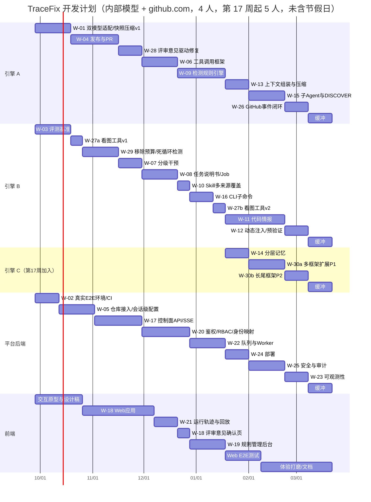

# 开发计划与里程碑（内部模型版）

> **状态说明（2026-09-25）**：本文是后续内部双模型等能力的 📐 开发规划，排期与人周沿用旧估算，尚未按本次增量重排。本次 `82d74ca`、`f5cc31b` 适配的是 DeepSeek 类 Chat Completions 服务：默认原生浏览器 function tools、`deepseek-chat`，视觉模型默认空，JSON 仅显式 legacy 配置。当前已补充 Skill 注入、渐进式加载、触发器和版本哈希记录；内部双模型看图工具、通用 ToolSpec 注册表、Anthropic 协议、自动能力矩阵或自动协议回退仍未实现。
> 当前工作区离线重点验证 85 项通过，不等同于干净 HEAD checkout 通过；真实 API + MCP + Docker E2E 仍未完成。当前事实与剩余规划分别列在第 1.2 节及后续工作包。
> **M0 进展补充（2026-09-28）**：最新合并回归 92 passed in 19.78s、数据库混合组 15 passed in 2.91s / 0 skipped（含 1 项实际 PostgreSQL 用例）；此前 Web 降级警告 SSR 3 passed、typecheck 通过。最新 `artifacts/real-e2e/m0-rerun.json` 的 B01 仍为 `failed`，Python 退出码 2：子进程访问 Docker named pipe 被拒绝，未进入模型/MCP；直接 Docker CLI 返回 29.4.0（linux），重测后既有 PostgreSQL 仍 healthy，本轮唯一授权请求因审批服务 503 未执行。此前批次和报告保留在 `00-项目进度/差距清单.md`、`00-项目进度/完成度评估.md`；本版其余 M0 目标及真实闭环门禁仍未满足。
>
> 本版规划前提：
> 1. **不包含任何模型训练工作**（SFT / DPO / RL、数据集构建、标注、蒸馏）。
> 2. 目标部署环境使用**公司内部部署的模型 API**；接入能力与真实验证仍待完成。
> 3. **Agent 的检测与修复能力是核心交付物**。运行轨迹只用于审计、调试、回放和评测。
>
> 规划中的内部环境与决策（2026-09-25，待接入确认）：
> - **编码模型**：不支持图片输入，支持结构化输出和工具调用。
> - **多模态模型**：支持图片，结构化输出和工具调用能力未知。
> - **代码托管**：github.com（公司在 github.com 上的组织），不使用 GitHub Enterprise Server（GHES）。
> - **仓库配置粒度**：用户在每个会话 / 任务中自行填写仓库地址，不是整个应用只配一个仓库。
> - **探索决策**：由编码模型读文本快照完成，多模态模型作为「看图工具」按需调用（下文称方案 B）。
> - **GitHub 事件接收**：内网部署的服务收不到 github.com 的 Webhook，先用轮询；以后运维能提供公网入口时再切换为 Webhook。
> - **PR 评审意见**：作为新的提示词指导修复。评审意见先由配置的文本模型整理优化（这次调用使用单独的 system prompt），默认经人工确认后才启动修订；与 PR 发布一起放在 M1（W-28）。
> - **运行限制**：Run 累计用量只计量，不以总调用数、token、费用或运行时长设预算。单次请求与工具交互仍保留有限尝试／轮次保护；未知结果优先暂停核查。循环检测与其余错误处理的完整目标见第 3 节、W-29，不能将规划理解为当前所有错误都无限重试。
> - **代码分析范围**：AST 分析覆盖主流前端语言（HTML、CSS、JS / TS、JSX / TSX 等）、UI 框架（Vue、React、Angular、Svelte 等）和工程化工具（Vite、webpack、Next.js、Nuxt 等），并尽可能通用（见 `05-代码分析`）。基础部分在 W-11 / W-12，多框架扩展（W-30a / W-30b，5 人周）也放进 M3；为此第 17 周起增加 1 名引擎工程师。
>
> 本版的第一稿有两处与代码事实不符，已更正：
> - 现有程序**已支持**分别配置文本模型和视觉模型（`TRACEFIX_TEXT_MODEL` / `TRACEFIX_VISION_MODEL`）。视觉模型默认空；显式配置且服务兼容后才走带图路径（下文称方案 A），不能以配置入口存在宣称真实运行已验证。
> - 命令行**已支持**按会话配置仓库（`/remote set --scope session`）。
>
> 第二稿按 GHES 设计，现已改为 github.com：删除了主机白名单、公司 CA、`/api/v3` 前缀等 GHES 专属设计。`RepoProvider` 接口仍保留 GHES / GitLab 作为扩展点。
>
> 上一版计划 `开发计划与里程碑.md` 已被本版取代，两版差异见第 11 节。

## 1. 范围

### 1.1 范围内与范围外

| 范围内 | 范围外 |
|---|---|
| 双模型接入：编码模型负责决策，多模态模型作为看图工具 | SFT / DPO / GRPO 训练，GPU 训练环境 |
| 真实环境端到端闭环：用户填写 GitHub 仓库 → 检测 → 修复 → 验证 → PR | 训练数据导出器、数据集版本管理、标注工具 |
| 检测规则引擎与管理后台 | 学生模型蒸馏、以训练为目的的 reasoning 采集 |
| 工具调用、Skill、分级干预、任务说明书 | 以训练为目的的缺陷工厂（评测用的小规模缺陷集保留） |
| 代码情报（AST，覆盖主流前端语言、UI 框架与工程化工具）与动态注入、上下文管理、子 Agent | `training/` 目录的维护（冻结） |
| CLI 与 Web 产品化、鉴权权限、企业级运维 | GHES、GitLab 等其他托管平台（`RepoProvider` 接口保留为扩展点） |
| PR 评审意见驱动修复：文本模型整理提示词 → 人工确认 → 修订 Run | |
| Run 累计只计量，完善循环检测、单次交互保护和未知结果暂停 | |
| **评测基准**：衡量 Agent 能力改进的唯一手段 | |

### 1.2 现有代码的状态与调整

| 现状 | 位置 | 调整 |
|---|---|---|
| ✅ 文本与视觉模型名可分别配置；默认文本 `deepseek-chat`、视觉模型空，只有显式配置视觉模型才发截图；截图证据仍保留 | `backend/packages/agent/src/tracefix/model/gateway.py:75`、`backend/packages/agent/src/tracefix/runtime/engine.py:419` | 📐 方案 B 的看图工具与 `decision_model: coding\|vision` 开关待实现；内部 API 兼容性、视觉输入必须实测 |
| ⚠️ 两种模型仍共用服务地址和密钥 | `backend/packages/agent/src/tracefix/model/gateway.py:73` | 📐 增加视觉模型独立地址与凭据 |
| ✅ native 浏览器请求携带 function tools，不强制 `json_object`；显式 JSON legacy 和非工具结构化输出使用 JSON 格式 | `backend/packages/agent/src/tracefix/model/gateway.py:248` | 保留显式模式选择；📐 `json_schema` 和能力探测需按服务支持情况另行适配，没有自动协议回退 |
| 默认服务为 DeepSeek 类 Chat Completions，本次适配没有扩展为任意内部模型协议 | `backend/packages/agent/src/tracefix/model/gateway.py:73`、`.env.example:4` | 📐 内部部署需提供兼容接口或新增适配器，重新确认默认值与部署配置 |
| DeepSeek 默认关闭 thinking；服务返回的 reasoning 字段可留存在原始响应中 | `backend/packages/agent/src/tracefix/model/gateway.py:261` | 📐 制定经验证的 thinking 配置策略；自动能力矩阵未实现 |
| ✅ 原生浏览器工具按参数校验 → policy → MCP 执行；完整记录 assistant/tool 配对、工具结果、每次有效 usage 与重试坐标；Skill 按阶段和触发器渐进式加载并审计版本哈希 | `backend/packages/agent/src/tracefix/model/gateway.py:106`、`backend/packages/agent/src/tracefix/runtime/engine.py:366`、`backend/packages/agent/src/tracefix/knowledge/context.py` | 📐 通用 ToolSpec 注册表、并行只读工具与其他协议仍待实现 |
| ✅ 按会话配置仓库：`/remote set --scope session`，会话配置优先于项目配置，只存在内存中 | `cli/workspace.py:196`、`cli/main.py:59,67-71,276`、`remote.py:84-89` | 保留该机制；**默认作用域从 project 改为 session**（现在默认写入项目级配置并持久化保存） |
| ✅ 地址校验只接受 `owner/repo` 或 github.com 地址，clone 地址固定为 github.com，与托管平台一致 | `remote.py:17-28,109` | 保留；`tools/github/prepare_github_run.py` 按 D-08 删除或并入 |
| ⚠️ clone 没有处理认证：私有仓库依赖宿主机上配置的 git 凭据，没有配置时会在终端提示输入或直接失败 | `remote.py:108-111` | 由运行时注入短期令牌（经 `GIT_ASKPASS` 传给 git，不出现在命令行、日志和轨迹中），并设置 `GIT_TERMINAL_PROMPT=0`（W-05） |
| ⚠️ 会话配置只替换代码目录；启动命令、镜像、允许修改的文件、被测应用地址仍来自已注册项目 | `cli/main.py:275,282,284-285,309` | 按仓库解析 Profile：已审计过的仓库直接复用；新仓库走「探测 → 草稿 → 用户确认」（W-05） |
| ⚠️ 续跑会拒绝已 `FIX_VERIFIED` 的 Run，而产生 PR 的 Run 都是这个结果；system prompt 固定拼接，没有按用途替换的入口 | `runtime/continuation.py:6-9`、`model/gateway.py:95` | 新增修订 Run（`review_revision`），从 PR 分支出发；网关增加按用途选择 system prompt 的入口（W-28） |
| clone 超时固定为 120 秒；目标目录已是 Git 工作区时直接复用，不 fetch | `remote.py:101-104,111` | 超时改为可配置，并使用 `--filter=blob:none` 部分克隆；复用工作区前先 fetch 并核对基线提交 |
| ✅ Run 的 `Usage` 只计量，已有状态／动作／错误重复与无进展检测；每次有效模型 usage 均累计 | `backend/packages/agent/src/tracefix/runtime/contracts.py:68`、`backend/packages/agent/src/tracefix/runtime/engine.py:160`、`backend/packages/agent/src/tracefix/runtime/engine.py:328` | 📐 继续完成 W-29 剩余场景及评测，保留默认 3 次请求尝试／8 轮工具交互保护 |
| ✅ 不安全网络结果与 MCP 未知副作用暂停核查；确定 not_sent 的模型请求可恢复准确历史，历史工具轮次不清零 | `backend/packages/agent/src/tracefix/model/gateway.py:271`、`backend/packages/agent/src/tracefix/runtime/engine.py:350`、`backend/packages/agent/src/tracefix/runtime/engine.py:478` | 保持未知状态优先于循环检测；其余错误策略按第 3.4 节逐项验收，不能概括为全部已实现 |
| 学生 / 教师路由仅允许显式 JSON student；学生网络结果不明不会触发教师继续执行 | `backend/packages/agent/src/tracefix/model/gateway.py:550` | 📐 按用途路由与内部双模型角色分工另行实现 |
| Web 的 Chat 由 Node 直接调用外部模型 | `server/index.mjs:128-154` | 统一经过后端模型网关 |

## 2. 内部环境

### 2.1 规划假设（待真实接入确认）

| 项 | 结论 | 设计决策 |
|---|---|---|
| 编码模型 | 不支持图片；支持结构化输出、工具调用 | 负责全部决策类调用，包括探索动作（方案 B）；主路径使用原生 `tools` + `json_schema` |
| 多模态模型 | 支持图片；结构化输出和工具调用未知 | 只作为看图工具被调用，**不做决策**；输出先按 JSON 宽松解析，失败时降级为纯文本；结论不作为确定性门禁 |
| 代码托管 | github.com（公司组织） | `RepoProvider` 以 GitHub REST（`https://api.github.com`）为主实现 |
| 仓库配置粒度 | 按会话 / 任务，由用户填写 | 只接受 github.com 仓库（现有校验已满足），凭据只发往 github.com / api.github.com；不限制用户使用组织内的哪个仓库，能访问哪些仓库由 GitHub App 的安装范围决定 |
| 事件接收 | 先轮询 | 内网服务收不到 github.com 的 Webhook；先轮询 PR 评论、评审和 check 状态，以后有公网入口再切换为 Webhook |

### 2.2 仍需确认（M0 第 1 周完成）

| 项 | 影响 | 确认方式 |
|---|---|---|
| 多模态模型是否支持结构化输出、工具调用、一次输入多张图 | 看图工具的解析方式；能否直接做修复前后截图对比 | `tracefix doctor --model vision` 实测 |
| 两个模型是否使用同一个服务地址和凭据 | 是否需要启用独立配置 | 模型平台团队 |
| 两个模型的上下文窗口、QPS / 并发上限、延迟 | 上下文窗口分区、并发数与客户端限流（超出时排队，不结束 Run） | 实测，并与模型平台团队确认 |
| 编码模型是否输出 reasoning | 仅影响调试体验 | 实测 |
| 组织是否允许安装 GitHub App（安装范围：全部仓库 / 指定仓库）；是否允许使用 fine-grained PAT（组织可以要求审批） | 认证方案 | GitHub 组织 owner |
| 组织是否启用了 SAML SSO 或 IP 允许列表（只有 Enterprise Cloud 组织才可能启用） | 启用时令牌需要 SSO 授权，Worker 的出口 IP 需要加入允许列表 | GitHub 组织 owner |
| 内网访问 github.com / api.github.com 是否需要经过出口代理；代理是否解密 TLS | git 与 httpx 的代理和 CA 配置 | 运维 |
| 分支保护、必需检查、PR 规范 | 发布流程 | 代码托管规范负责人 |
| 夜间 E2E 使用的沙箱仓库（建议使用独立的测试组织，或组织内的专用私有仓库） | CI | GitHub 组织 owner（**GitHub App 安装和沙箱仓库都需要 owner 批准，M0 第 1 周就要发起**） |
| 能否提供公网入口，接收 github.com 的 Webhook | 事件接收能否从轮询升级为实时推送（不影响 GA） | 运维 |

## 3. 运行限制：Run 计量与单次交互保护分层

### 3.1 原则

1. **Run 累计不设预算**：累计模型调用、浏览器动作、token、费用、补丁、子任务等 Usage 用于观测。此原则不取消单次模型请求的尝试上限、工具交互轮次上限或操作超时。
2. **只计量，不拦截**：用量照常记录，在 CLI（`/usage`）和 Web 上展示，用于观测和统计。用量高低都不会暂停或结束 Run。
3. **循环与未知结果分开处理**：重复且无进展可记为 `LOOP_DETECTED`／`ABNORMAL`；`UNKNOWN_OPERATION` 或需核查的 MCP 失败优先暂停，不能被循环检测覆盖，更不能自动重放副作用。
4. **错误策略目标**：按第 3.4 节分别反馈、有限重试、暂停或收尾；统一错误处理仍有待验收项。正常结论、人工取消仍会结束 Run，不把「无累计预算」解释为无限请求。
5. **人工控制不变**：用户随时可以暂停、取消。暂停和等待审批期间不计时，也不会超时。

### 3.2 已实现保护与剩余规划

| 层级 | 当前行为 | 依据与后续工作 |
|---|---|---|
| Run 累计用量 | `Usage.charge()` 累计计数，不以历史预算字段终止 Run；旧字段仅兼容已有记录 | `backend/packages/agent/src/tracefix/runtime/contracts.py:68`；W-29 继续核查周边场景与长期运行评测 |
| 单次模型请求 | `max_attempts` 默认 **3 次总尝试**，包括首次调用；对允许的 HTTP／连接失败和输出校验错误有限重试 | `backend/packages/agent/src/tracefix/model/gateway.py:90`；不能把默认值解释为额外重试 3 次或无限重试 |
| 单次工具交互 | `max_tool_rounds` 默认 **8 轮**；每个新模型请求有自己的尝试额度，安全恢复时历史工具轮次继续计数 | `backend/packages/agent/src/tracefix/model/gateway.py:72`、`backend/packages/agent/src/tracefix/model/gateway.py:271`；不因恢复绕过轮次保护 |
| 不安全重试 | ReadTimeout 等发送结果不明、usage 不可确认、MCP 副作用结果不明时暂停核查 | `backend/packages/agent/src/tracefix/model/gateway.py:292`、`backend/packages/agent/src/tracefix/runtime/engine.py:478`；不盲目重放工具，不自动降级协议 |
| 安全恢复 | 仅确定 `not_sent` 且无需人工核查的模型请求，可保留失败 exchange 与 schema 对应历史后恢复 | `backend/packages/agent/src/tracefix/runtime/engine.py:350`、`backend/packages/agent/src/tracefix/runtime/engine.py:827`；成功后清除恢复标记 |
| 上下文窗口与资源并发 | 属于单次请求可容纳内容与执行资源的约束，不能与 Run 累计预算混同 | 📐 压缩、compact、统一资源调度按 W-13/W-22 实现 |
| 看图、评审修订、Job 等未实现流程 | 不采用旧规划中的 Run 累计预算；具体单次请求保护与错误恢复需随功能设计和验收 | 📐 不预先宣称这些流程已无条件支持无限轮次 |

### 3.3 死循环检测

现有检测器在安全边界使用运行时的状态、动作、错误与无进展信号（`backend/packages/agent/src/tracefix/runtime/engine.py:160`），不调用模型。下表是 W-29 的完整目标；补丁重复、跨 PR 轮次、按项目配置阈值等不能仅凭现有基础声明全部交付。未知操作和需核查的 MCP 失败先暂停，不进入自动重试或循环收尾。

| 信号 | 判定方式 | 预警 | 判定为循环 |
|---|---|---|---|
| 状态重复 | 状态指纹 = 阶段 + 页面快照摘要 + 待执行动作 + `patch_hash` + 最近一次失败签名；统计同一指纹在本 Run 中出现的次数 | 第 2 次 | 第 3 次 |
| 动作周期 | 最近的动作序列按周期重复，周期长度 1-4（例如 A→B→A→B） | 重复 2 个周期 | 重复 3 个周期 |
| 补丁重复 | 新补丁与本 Run 中已验证失败的补丁相同（`patch_hash` 一致）；或补丁在同一验证项上以相同的失败签名连续失败 | 首次出现 | 相同补丁第 2 次出现；或相同失败连续 3 次 |
| 错误重复 | 同一错误（类型 + 规范化后的消息）连续出现，期间状态指纹没有变化。包括策略拒绝、输出校验失败、工具报错、可重试的基础设施故障 | 3 次 | 5 次 |
| 无进展 | 连续若干步没有进展事件。进展事件包括：新的页面状态、新证据、新的失败签名、验证推进到下一项、补丁通过的验证项比之前多 | 20 步 | 40 步 |
| 跨轮重复（作用于 PR 跟踪） | 修订 Run 的 diff 与之前某一轮相同，或互为回退；同一评审线程连续多轮修订后仍被要求修改 | 同一线程连续 2 轮 | diff 相同或回退；或同一线程连续 3 轮 |

阈值统计的是**重复次数**，不是用量。只要 Run 持续产生新的进展，无论运行多久、调用多少次都不会触发。阈值可以按项目配置，默认值在 M1 用评测集校准。

**处理流程**

1. **预警**：发出 `loop.suspected` 事件；在下一次模型调用的受保护上下文中注入「检测到重复」提示，列出重复的动作、补丁或错误，要求换一种做法；CLI 和 Web 同时提示用户，用户可以追加提示或暂停。Run 继续运行。
2. **判定**：发出 `loop.detected` 事件，保存循环证据（重复的指纹序列、涉及的步骤范围、相关补丁和错误）；在下一个安全边界进入 FINALIZE，结果为 `LOOP_DETECTED`，状态为 `ABNORMAL`，并释放沙箱。
3. **重新启动**：只能由人工发起。用户查看循环证据后，执行 `/continue RUN_ID 提示` 续跑。循环证据会自动注入续跑的上下文，检测计数重新开始。
4. **PR 跟踪**：判定为跨轮循环时，PR 跟踪进入 `ESCALATED`（异常，已转人工），在 PR 上留言说明，不再自动整理新的评审意见；维护者可以手动恢复跟踪。

### 3.4 错误处理：当前基础与规划

| 错误 | 现状 | 调整 |
|---|---|---|
| 策略拒绝（越权 URL、未授权动作、不允许修改的路径） | 原生浏览器在执行前的策略拒绝会返回 `executed=false` 工具结果；过期 press 也在创建 operation/MCP 调用前拒绝 | 保持动作不执行，并据错误重新决策；其他路径仍需逐项验收 |
| 完整性校验失败（补丁在验证或审批后被改动、作用域发生变化） | 同上（`engine.py:549,599`） | 转 PAUSED，需要人工核查 |
| 模型输出不合格 | 网关在本次请求的总尝试上限内反馈校验错误；已有工具结果保持有效，纠错不能声称工具未执行；耗尽后抛结构化错误 | 保持有限请求保护与宿主循环检测分层；不自动切换协议 |
| 重放时元素无法绑定 | 已有 `ReplayUnbound` 返回探索／诊断的处理；frozen press 会绑定当前观测后经 policy/MCP 执行 | 继续验证剩余场景，不能沿用旧「必定 INCONCLUSIVE」预期 |
| 验证门禁拒绝证据 | `INFRA_FAILURE`，Run 结束（`engine.py:585-586`） | 从第一项重新验证 |
| 其他基础设施故障（容器、构建、网络、模型服务限流） | 网关对允许的 HTTP 状态有限退避重试；容器／构建等通用错误处理尚未统一验收 | 📐 按确定性结果与副作用分类逐项完善；不把所有网络错误视为可安全重试 |
| 受保护的上下文区块本身超出模型窗口（例如用户引导过长） | 超出字符上限即抛异常 | 转 PAUSED，提示用户精简内容 |
| 执行循环之外的未捕获异常 | 状态直接改为 `FAILED`（`cli/main.py:359-368`） | 转 PAUSED，需要人工核查，可以从 checkpoint 恢复 |
| 结果未知、网络中断 | `UNKNOWN_OPERATION`／需核查的 MCP 失败优先 PAUSED；确定 not_sent 的模型请求可安全恢复准确历史 | 已实现，保持暂停优先于错误重复检测；人工核查要求不能被 student fallback 绕过 |

仅适合继续执行的已知错误参与重试与循环判断；未知结果暂停具有更高优先级，不能因同一错误反复出现而丢失核查要求。

### 3.5 保留的机制（不属于预算）

| 机制 | 作用 | 保留的理由 |
|---|---|---|
| 单次操作超时（浏览器调用 45 秒、模型请求 90 秒、clone、沙箱命令） | 发现卡住的单次操作 | 超时只让这一次操作按故障处理（重试或暂停），不限制 Run 的总时长和总用量 |
| 模型请求尝试与工具交互轮次 | 默认 3 次总尝试、8 轮工具交互，恢复历史轮次继续计数 | 防止一次交互无限重发或执行工具；不限制 Run 累计 Usage |
| 复现判定（3 次重放中至少 2 次一致） | 判断缺陷能否稳定复现 | 这是判定规则；不稳定时以 `INCONCLUSIVE` 结论结束 |
| 上下文窗口分区与内容截断（快照、工具结果、Skill 正文、评论） | 让单次请求放得进模型窗口 | 窗口是模型本身的限制；超出时压缩，不结束 Run |
| 并发与限流（子 Agent 信号量、Worker 数量、客户端限流） | 适配沙箱和模型服务的容量 | 超出时排队，不拒绝，也不结束 Run |
| 补丁范围约束（任务说明书中的最大文件数、行数，以及 L2 约束） | 用户对改动范围的要求 | 超出时补丁被拒绝并反馈给模型，不结束 Run |

### 3.6 结果与状态调整

- **结果**：新增 `LOOP_DETECTED`；删除 `REPAIR_EXHAUSTED`、`POLICY_BLOCKED`、`INFRA_FAILURE`。test 模式下稳定复现的缺陷由 `INCONCLUSIVE` 改为新结果 `BUG_CONFIRMED`，`INCONCLUSIVE` 只表示复现不稳定。
- **运行状态**：`FAILED` 改为 `ABNORMAL`（异常），只由死循环检测写入。终止状态只剩三种：`COMPLETED`（得出结论）、`CANCELLED`（用户取消）、`ABNORMAL`（死循环）。`can_continue` 允许续跑 `ABNORMAL` 的 Run。
- **转移表**：新增 `REPRODUCE → EXPLORE`（重放无法绑定时重新录制）。`DIAGNOSE → FINALIZE`，以及 `EXPLORE → FINALIZE` 中除 `NO_BUG_FOUND` 以外的情况，只在判定为循环时发生。
- **存量数据**：已有记录中的 `FAILED` 和三种旧结果按原样展示，不做迁移。

## 4. 双模型架构：感知与决策分离（方案 B）

```text
              ┌──────────── 编码模型（无图；支持 tools / json_schema）────────────┐
观测 ────────▶│ 输入：压缩后的 a11y 快照 + console / network + 视觉结论（文本）      │──▶ 动作 / 补丁 / 计划
（文本部分）   └───────────────────────────────────▲─────────────────────────────┘
                                                  │ VisionReport（JSON 或降级文本）
截图 ──▶ 多模态模型（看图工具，按需调用）─────────────┘
```

**分两步落地**

| 版本 | 时间 | 内容 |
|---|---|---|
| v1 | M0（W-27a） | `Decision` 契约新增可选字段 `vision_request {question, region?}`；运行时调用多模态模型，把 VisionReport 放进上下文后重新决策。快照信息不足时自动触发（可交互元素过少，或存在大面积没有可访问名称的 canvas / img） |
| v2 | M2（W-27b，依赖工具框架 W-06） | 迁移为 `vision.inspect(question, screenshot_ref, region?)` 工具；接入 `visual` 类检测规则；VERIFY 阶段对视觉类 Finding 做修复前后截图对比 |

- **调用控制**：不设次数上限，按需触发；同一截图、同一问题的结果缓存复用；截图先缩放和裁剪再发送。反复对同一画面提同一个问题属于重复动作，由死循环检测处理（第 3 节）。
- **输出契约**：`VisionReport {answer, findings[{description, bbox?, confidence}], raw_text, structured}`。多模态模型支持结构化输出时直接使用；否则在提示词中要求 JSON 并宽松解析，失败重试 1 次；仍失败时把原文放进 `raw_text`，并标记 `structured=false`。
- **可信边界**：视觉结论只作辅助证据，可以生成 `suspected` 状态的 Finding、引导探索方向，但不能单独判定 VERIFY 通过或失败。视觉类修复进入审批时，展示修复前后截图和视觉结论，由人工确认。
- **对照与回退**：方案 A 不需要额外开发，M0 在同一评测集上跑一次作为对照。如果方案 B 明显不如方案 A，可以通过 `decision_model` 开关让探索决策临时切回方案 A。

## 5. GitHub 接入与会话级仓库配置

| 项 | 设计 |
|---|---|
| 填写方式 | 用户在每个会话 / 任务中填写 `https://github.com/<owner>/<repo>` 或 `owner/repo`。CLI 用 `/remote set` 或 `tracefix run --repo`，Web 在任务向导里直接填写 |
| 作用域 | 仓库、基线分支、工作分支默认只在当前会话有效；项目级配置只是可选的默认值；同一进程里的多个会话互不影响 |
| 地址校验 | 只接受 github.com 仓库（现有 `remote.py:17-28` 已满足），凭据只会发往 github.com / api.github.com |
| Profile 解析 | 按 `owner/repo` 查找已审计的 Profile，找到就直接复用；没有就执行探测 → 生成草稿 → 用户在会话中确认命令。审计结果按「仓库 + lockfile 哈希」缓存，同一仓库不必每次重新审计 |
| 网络 | 内网经出口代理访问 github.com（git 使用 `http.proxy`，httpx 使用 `proxy`）；代理解密 TLS 时再配置公司 CA，否则使用系统默认 CA |
| 认证 | 凭据由部署统一管理，用户不需要每个会话都填写。首选安装在公司组织上的 GitHub App：installation token 有效期 1 小时，按阶段申请最小权限，能访问哪些仓库由安装范围决定。过渡方案是 bot 账号的 fine-grained PAT，存放在公司密钥管理系统中。个人模式下也可以使用用户自己的 PAT（存在本机 keyring）。令牌一律经 `GIT_ASKPASS` 传给 git，不出现在命令行、日志和轨迹中 |
| 提交身份 | 📐 GitHub 发布需映射 GitHub App / PAT 的 bot 身份，并在 trailer 写入 Run ID、补丁哈希和审批人 |
| 身份映射 | 公司 SSO 用户与 GitHub 登录名对应，用于指派 reviewer、记录审批人 |
| 状态回写 | 通过 Checks API 回写「TraceFix 验证」的逐项结果和报告链接。只有 GitHub App 能创建 check run，使用 PAT 时降级为 commit status |
| PR 内容 | github.com 是外部服务：PR 正文只放文字摘要、验证结果和内部报告链接，不上传截图、日志等内部产物；推送前做 secret scanning |
| 评审意见 | 由配置的文本模型（单独的 system prompt）整理成提示词，人工确认后启动修订 Run，在同一 PR 追加 commit 并逐条回复评论（见 `03-Agent运行时/PR评审意见驱动修复.md`） |
| 事件接收 | 默认轮询：按 PR 定时拉取评论、评审和 check 状态，使用 ETag 条件请求（返回 304 时不消耗主速率配额）。运维以后能提供公网入口时再切换为 Webhook，入口服务校验签名后转发到内网 |
| 速率限制 | 遵守 `Retry-After` 与 `x-ratelimit-*` 响应头退避；创建 PR、评论等写操作串行执行，避免触发次级速率限制 |
| 分支保护 | 默认创建 Draft PR；遇到必需检查时不绕过；合并由人工完成 |
| 测试 | 用假 GitHub 服务（HTTP stub）做单元测试，覆盖 PR 创建、PR 已存在、速率限制、401 / 403 / 422；夜间在沙箱仓库上跑真实 PR，结束后自动关闭 |

## 6. 工作包与人力

**团队**：

- 第 1-16 周：Agent 引擎工程师 ×2（A、B）、平台后端 ×1、前端 ×1，共 4 人。
- 第 17 周（M3）起：增加 1 名引擎工程师 C（代码情报方向），共 5 人。
- 总工期约 **25 周**。如果 C 从第 1 周就加入并重新排布，约 22 周。

| 工作包 | 内容 | 人周 | 对应差距 |
|---|---|---|---|
| W-01 双模型适配 | 📐 视觉模型独立地址与凭据、能力矩阵、`json_schema`、看图与决策分工、方案 A 开关、快照压缩 v1、限流及内部部署配置；现有 DeepSeek 原生浏览器 tools 与实际 usage 计量可复用，不代表双模型方案已完成 | 3（旧估算） | 新增 |
| W-02 真实 E2E 环境与夜间 CI | 沙箱、Postgres、浏览器镜像、两个模型连通；内网访问 github.com 的出口；github.com 沙箱仓库；夜间真实 E2E | 2 | G-01 |
| W-03 评测基准 | `evals/run.py` 串联；补齐对照用例和指标；缺陷集扩充到 40 个以上（其中 6-8 个视觉类），**只用于评测**；方案 A / B 对照；CI 回归门禁 | 3 | G-22（调整） |
| W-04 发布与 PR | PUBLISH 阶段、GitHub App / PAT 令牌管理、bot 身份、PR 模板、Checks 回写（PAT 时降级为 commit status）、发布审批、幂等、速率限制退避 | 4 | G-02 |
| W-05 仓库接入与会话级配置 | 默认作用域改为 session；私有仓库 clone 认证、复用工作区前 fetch；按仓库解析 Profile（与已注册项目解耦）；技术栈探测、Profile 草稿、命令审计与缓存；镜像缓存 | 3 | G-03 |
| W-06 工具调用框架 | ✅ 原生浏览器 function tools、policy/MCP 执行与重试审计基础；📐 通用 ToolSpec 注册表、并行只读工具、提交类工具和扩展协议仍待完成 | 3（旧估算） | G-08 |
| W-07 分级干预 | Guidance L1 / L2 / L3、`user_guidance` 区块、ack 机制 | 2 | G-04 |
| W-08 任务说明书与 Job 编排 | TaskBrief（含仓库地址）、PLAN 阶段、计划确认、Job → 多 Run | 3 | G-05 |
| W-09 检测规则引擎 | 规则实体、RuleResolver、oracle 规则、guided 规则强制注入、Finding | 4 | G-06 |
| W-10 Skill 多来源覆盖 | 📐 实现组织、项目与内置 Skill 的同名覆盖机制 | 1（旧估算，待重评） | 新增 |
| W-11 代码情报（基础） | 多语言解析框架、嵌入语言、统一代码模型与声明式适配器；HTML / CSS / JS / TS / JSX / TSX / JSON / Vue SFC 的结构层；原生 DOM、React、Vue 3（Pinia、vue-router、vue-i18n）适配；Vite / webpack、tsconfig 别名、npm / pnpm workspace、Next.js / Nuxt 路由；tsserver 与 Vue LSP；source map 堆栈还原；网络映射到 Node 服务端（含手写路由）；`ui_map`。前 2 周冻结统一代码模型与适配器接口，供 W-30a 使用（详见 `05-代码分析`） | 5 | G-11 |
| W-12 动态注入与补丁预验证 | 注入器、`code_insights` 区块、多锚点 StructuredEdit；增量预验证：语法、tsc / vue-tsc、ESLint、Stylelint、html-validate | 2 | G-12 |
| W-13 上下文组装与压缩 | 按 token 计算的上下文窗口分区、快照差分、compact | 2 | G-13 |
| W-14 分层记忆 | L1 / L2 记忆、SQLite 回退、降级告警 | 2 | G-14 |
| W-15 子 Agent 与 DISCOVER | 多角色、并发调度、gui-scout | 3 | G-15 |
| W-16 CLI 子命令 | 顶层子命令（`run --repo` 直接接受仓库地址）、NDJSON 输出、退出码约定 | 2 | G-28 |
| W-17 控制面 API | `tracefix serve`、统一存储、SSE | 4 | G-16 |
| W-18 Web 应用 | 运行详情、任务向导（直接填写仓库地址）、仓库默认设置、审批中心（含视觉证据）、评审意见确认页、工作台 | 6 | G-17 |
| W-19 规则管理后台 | 列表、编辑器、试运行、规则集、版本、统计 | 3 | G-07 |
| W-20 鉴权与 RBAC | 公司 SSO（OIDC）、API Token、角色矩阵、部门级隔离、GitHub 身份映射 | 4 | G-18 |
| W-21 运行轨迹与回放 | Step 级记录、context_manifest、Web 回放查看器 | 2 | 替代 G-20 |
| W-22 队列与 Worker | `SKIP LOCKED` 队列、心跳接管、跨进程锁 | 3 | G-19 |
| W-23 可观测性 | OTel、metrics（含两个模型各自的延迟和错误率）、看板、告警 | 2 | G-24 |
| W-24 部署 | 公司内部 K8s / Helm、内部镜像仓库、离线安装包 | 2 | G-25 |
| W-25 安全与审计 | 审计哈希链、密钥管理、secret scanning、镜像签名 | 3 | G-26 |
| W-26 GitHub 事件闭环 | 轮询 PR 评论 / 评审 / check 状态（ETag 条件请求）；Issue / PR 评论自动触发（评审意见修订复用 W-28 的流程）；预留 Webhook 接收接口 | 2 | G-27 |
| W-27a 看图工具 v1 | `vision_request`、自动触发、VisionReport 宽松解析与降级、结果缓存 | 1 | 新增 |
| W-27b 看图工具 v2 | 迁移为 `vision.inspect` 工具、`visual` 类规则、修复前后对比 | 1 | 新增 |
| W-28 评审意见驱动修复 | 采集与过滤评审意见；网关按用途选择 system prompt；「评审意见整理」system prompt 与 `ReviewGuidance` 契约；确定性校验；CLI 并排确认（Web 确认页计入 W-18）；修订 Run（从 PR head 出发、追加 commit、逐条回复评论）；整理评测集 | 2 | G-29 |
| W-29 Run 计量与循环检测 | ✅ Usage 只计量、循环检测基础、未知结果优先暂停与安全恢复；📐 补齐循环信号、错误策略、状态兼容、展示和长期评测；保留 3.2 节的单次尝试／轮次保护 | 3（旧估算） | G-30 |
| W-30a 代码情报多框架扩展（P1） | Vue 2、Angular、Svelte / SvelteKit、Lit / Web Components；SCSS / Less、YAML、CSS-in-JS、Tailwind、SVG；组件库角色表；只读 DOM 探针（新增 `inspect` 动作）与插桩定位回放；Rspack、Angular CLI；对应的预验证（svelte-check、ngc 等）与多框架夹具 | 3 | G-31 |
| W-30b 代码情报长尾框架（P2） | Solid、Astro、Remix / React Router 7、UmiJS、MDX、GraphQL、tRPC、模板引擎（Handlebars / EJS / Pug）、跨端框架 H5（uni-app、Taro）、非 Node 服务端路由（Python / Go / Java）；对应夹具 | 2 | G-31 |
| | **合计** | **87**（加 20% 缓冲 ≈ 104） | |

## 7. Agent 核心能力指标

| 指标 | 定义 | M0 | M2 | M3 | GA 门槛* |
|---|---|---|---|---|---|
| 修复成功率 | FIX_VERIFIED / 有效缺陷数 | 基线（方案 B，另记方案 A 对照） | 不低于基线 | 基线 + 15 个百分点 | ≥ 60% |
| 复现率 | 稳定复现（3 次中 ≥2 次）/ 有效缺陷数 | 基线 | 不低于基线 | 基线 + 10 个百分点 | ≥ 80% |
| 定位准确率 | 补丁位置与标准答案重合（符号级） | 基线 | — | 基线 + 20 个百分点 | ≥ 70% |
| GUI → 代码定位命中率 | UiCodeMap 前 3 名候选含标准答案位置的比例（多框架定位夹具，按框架统计） | — | — | P0 框架 ≥ 80%；P1 / P2 框架 ≥ 70% | 已支持的框架均 ≥ 80% |
| 首个补丁通过率 | 第一个补丁即通过六类验证的比例 | 基线 | — | 基线 + 15 个百分点 | ≥ 45% |
| 误报率 | NO_BUG 对照组中被判为有缺陷的比例 | 基线 | ≤ 基线 | ≤ 10% | ≤ 10% |
| 输出格式错误率 | 编码模型输出没通过契约校验的比例 | 基线 | ≤ 2% | — | ≤ 2% |
| 视觉缺陷检出率 | 评测集中视觉类用例的检出比例 | 基线 | ≥ 50% | ≥ 60% | ≥ 70% |
| 死循环异常率 | 以 `LOOP_DETECTED` 结束的 Run / 全部 Run | —（W-29 完成后测量） | ≤ M1 基线 | ≤ 10% | ≤ 5% |
| 循环误判率 | 被判定为循环、但人工复核认为仍在有效推进的 Run 比例 | — | ≤ 5% | ≤ 2% | ≤ 2% |
| 平均输入 token / 调用次数 / 耗时 | 每个缺陷的平均值 | 基线 | — | token 下降 30% | 只观测，不设门槛 |

\* GA 门槛是初步建议，M0 拿到内部模型的真实基线后需要重新校准。

Run 累计只计量后，原来因总预算耗尽而结束的场景可能继续推进；单次尝试／工具轮次保护、未知结果暂停与人工控制仍有效。W-29 完整验收后需要重跑评测，作为「M1 基线」；M2、M3 的对比以该基线为准。

## 8. 里程碑

| 里程碑 | 周次 | 包含工作包 | 阶段跃迁 | 验收标准 |
|---|---|---|---|---|
| **M0 模型接入与基线** | W1-W4 | W-01、W-02、W-03、W-27a | L2 → L2+ | 两个模型的能力矩阵已固化；方案 B 在真实环境中跑通 bugboard-target（至少 3 个 FIX_VERIFIED，出基线后再校准）；评测基线报告含方案 A 对照；测试 100% 通过；内网访问 github.com 已打通；GitHub App 安装和沙箱仓库的申请已发起 |
| **M1 交付闭环（GitHub）** | W3-W9 | W-04、W-05、W-28、W-29 | → **L3 Alpha** | 在会话中填写一个**未预先注册**的 github.com 私有沙箱仓库地址 → 确认自动生成的 Profile → 生成 Draft PR（含审批），Checks 回写可见；在该 PR 上提交行内评审意见 → 文本模型整理出提示词、经人工确认 → 修订 Run 在同一 PR 追加 commit，并逐条回复评论；同一进程内两个会话分别配置不同仓库，互不影响；不以 Run 累计用量结束任务，保留单次交互保护与未知结果暂停；循环用例正确判定、持续有进展的长任务零误判；M1 基线报告已产出 |
| **M2 可控 Agent** | W8-W16 | W-06~W-10、W-16、W-27b | L3 | 规则强制注入可以在 request artifact 中核验；L1 提示在下一次调用时生效；oracle 规则命中后生成 Finding；评测不回退 |
| **M3 能力增强** | W17-W25 | W-11~W-15、W-30a、W-30b | L3 | 达到第 7 节 M3 列的指标；每项能力都附开启 / 关闭的消融对比报告；多框架定位夹具（`05-代码分析/AST分析与动态注入.md` 第 9 节）覆盖 P0、P1、P2 全部框架，每个框架都能从失败断言定位到源码，降级时有 `code_intel.degraded` 事件 |
| **M4 Web 产品化** | W5-W16 | W-17~W-21 | → **L4 Beta** | 试点用户只用 Web，在任务向导中填写 GitHub 仓库地址，一直走到 PR；SSE 事件延迟 P95 ≤ 2 秒 |
| **M5 企业级与 GA** | W15-W25 | W-22~W-26 | → **L5 / L6** | 达成 SLO；安全评审无高危问题；2 个内部试点团队验收；达到第 7 节 GA 门槛 |

## 9. 甘特图



- **节假日**：国庆（W1-W2）会让 M0 顺延约 1 周；春节（2027 年 2 月上旬，约 W19-W20）会让 M3 和 M5 顺延 1-2 周。
- **关键路径**：W-01 → W-02 基线 → W-04 → W-28 → M1 Alpha（第 9 周）；W-17 → W-18 → M4 Beta；W-06 → W-27b；W-11 接口冻结 → W-30a → W-30b → M3。
- **W-28 带来的调整**：
  - W-28 放在引擎 A 的 W-04 之后，Alpha 从第 7 周推迟到第 9 周；引擎 A 的后续工作包顺延 2 周，M2 结束时间从第 14 周推迟到第 16 周。
  - 为了不压缩引擎 A 的缓冲，W-23 可观测性改由平台后端承担，平台后端的缓冲从 3 周减到 2 周。
  - W-09 顺延后，W-19 仍需等规则 schema 冻结；前端先做评审意见确认页，W-19 随之推迟 1 周，M4 结束时间从第 15 周推迟到第 16 周。
- **W-29 带来的调整**：
  - W-29 放在引擎 B 的第 5-7 周，在 Alpha（第 9 周）之前完成，不影响关键路径。
  - 引擎 B 的后续工作包顺延 3 周：M2 从第 8 周开始，结束时间仍是第 16 周；M3 结束时间从第 22 周推迟到第 25 周，与 GA 同时结束。
  - 引擎 B 的缓冲一度从 3 周减为 0。W-30 调整后，W-14 移交给引擎 C，引擎 B 恢复 2 周缓冲（见下条）。
- **W-30 带来的调整**：
  - **放进 M3**：代码情报的多框架扩展（W-30a / W-30b，共 5 人周）放进 M3。第 17 周起增加 1 名引擎工程师 C，工作 9 周：负责 W-14 分层记忆、W-30a、W-30b，末尾留 2 周缓冲。
  - **开工顺序**：W-30a 依赖 W-11 前 2 周冻结的统一代码模型与适配器接口，W-30b 依赖 W-11 完成，所以引擎 C 先做与代码情报无关的 W-14，第 19 周再开始 W-30a。
  - **总工期**：仍约 25 周，GA 时间不变；M3 仍在第 25 周结束。
  - **拿不到人手时的预案**：W-14、W-30a、W-30b 全部回到引擎 B，M3 推迟到约第 30 周；只保留 W-30a、把 W-30b 推迟到 GA 之后，M3 约在第 28 周结束。
- **依赖说明**：
  - W-19 规则后台在 W-09 的第 1 周冻结规则 schema 之后开工。
  - W-18 在 W-17 就绪前，先按 API 契约和 mock 数据开发。去掉 GHES 专属工作后，W-05 缩短 1 周，W-17 可以提前 1 周开工，W-18 依赖 mock 的时间相应缩短。
- **外部依赖**：在公司组织上安装 GitHub App、开通沙箱仓库需要组织 owner 批准；内网访问 github.com 可能需要开通出口代理。这些在 M0 第 1 周就要发起；批准前，W-04 先用个人 PAT 和假 GitHub 服务开发。

## 10. 质量门禁与风险

**质量门禁**

1. 凡是改动提示词、上下文、工具、规则引擎、Skill、代码情报、看图工具的 PR，CI 都要跑评测快速子集，夜间跑全量；修复成功率下降超过 3 个百分点即阻止合并。
2. 提示词模板、Skill、能力矩阵都带版本号，并记录在每个 Run 的报告中。
3. 任一内部模型升级或切换时，先在评测基准上对比，指标不下降才允许切换默认模型。
4. 夜间真实 E2E 连续失败 2 次即告警，并冻结与引擎相关的合并。
5. 修改死循环检测的信号或阈值时，必须通过评测集中的循环用例和长进展用例：循环用例全部被判定，长进展用例零误判。
6. 📐 CI 增加检查：不新增以 Run 累计用量结束任务的预算；单次请求尝试、工具轮次、操作超时与未知结果暂停必须保留独立测试。

**风险**

| 风险 | 概率 | 影响 | 应对 |
|---|---|---|---|
| 方案 B 中编码模型看不到页面，探索质量依赖快照质量 | 高 | 高 | 快照压缩 v1 和看图工具 v1 都放在 M0；oracle 规则和代码情报做确定性兜底；M0 与方案 A 对照，明显落后时用开关临时切回方案 A |
| 多模态模型结构化输出不可靠 | 中 | 中 | 宽松解析，失败时降级为文本；视觉结论只作辅助证据；视觉类修复需要人工确认 |
| 两个模型串联导致延迟上升 | 中 | 中 | 看图工具按需触发；相同截图和问题的结果缓存复用；截图先裁剪；视觉调用与其他只读工具并行 |
| 去掉预算后，单个 Run 长时间运行、占用大量模型容量 | 中 | 中 | 无进展检测按步数判定；用量实时展示；同时运行的 Run 由资源调度排队；用户可以随时暂停或取消 |
| 死循环检测误判（打断仍在推进的 Run）或漏判（在循环中空转） | 中 | 高 | 先预警、注入提示，再判定；阈值可按项目配置；评测集覆盖循环和长进展两类用例；判为异常的 Run 可以人工续跑 |
| 用户填写的仓库技术栈无法自动识别 | 高 | 中 | 先覆盖公司主流前端技术栈；探测失败时引导用户在会话中手写 Profile |
| 内部模型能力不足 | 高 | 高 | 受约束解码、小步决策、补丁预验证、按用途路由 |
| 组织 owner 审批（App 安装、沙箱仓库）耗时 | 中 | 中 | 提前发起申请；用 PAT 过渡 |
| 内网到 github.com 的网络不稳定，或被出口策略拦截 | 中 | 中 | M0 打通出口代理；clone / push 超时可配置，按幂等回执重试；部分克隆减少传输量 |
| PR 中带出内部信息（内部地址、测试账号、日志） | 中 | 中 | PR 正文只放文字摘要和内部报告链接；推送前做 secret scanning；运行产物只保存在内网 |
| GitHub 速率限制（含次级速率限制） | 低 | 低 | 优先使用 GitHub App；轮询使用条件请求；按 `Retry-After` 退避；写操作串行 |
| 文本模型误解评审意见，或评论中夹带提示词注入 | 中 | 中 | 单独的 system prompt 把评论当作数据；只采纳有写权限者的评论；确定性校验（引用、范围、禁止事项、遗漏）；默认人工确认；整理评测集回归 |
| 内部 API 容量不足 | 中 | 中 | 客户端限流、排队；与模型平台团队约定 SLA |
| 多框架扩展依赖社区维护的 tree-sitter 语法（Vue、Svelte、Angular、Astro、SCSS 等），可用性、ABI 兼容性、许可证不确定 | 中 | 中 | M3 第 1 周逐个核实；不可用的语言先停留在文本级（L0），并发出降级事件；必要时自行维护语法分支 |
| 引擎工程师 C 第 17 周加入，上手期与春节（约第 19-20 周）重叠；或拿不到人手 | 中 | 中 | 先安排相对独立的 W-14；适配器以声明式查询为主，并有多框架夹具和评测兜底；拿不到人手时按第 9 节的预案顺延 |
| 范围蔓延 | 高 | 高 | 按里程碑设门禁；P2 项可推迟到 GA 之后 |

## 11. 与上一版的差异

| 项 | 上一版 | 本版 |
|---|---|---|
| 定位 | Agent + 训练数据生产 | Agent 能力是核心，轨迹只用于审计、调试、评测 |
| 模型 | DeepSeek 类 Chat Completions；默认文本模型处理文本观测，视觉模型默认空；只有显式配置视觉模型且请求带图才走视觉路径 | 📐 内部双模型：编码模型负责全部决策，多模态模型作为看图工具；方案开关待真实环境验证 |
| 代码托管 | github.com | github.com（不变；第二稿曾按 GHES 设计，已改回） |
| 仓库配置 | 项目级 Profile 为主 | 按会话 / 任务由用户填写；Profile 按仓库解析 |
| 事件接收 | GitHub Webhook | 先轮询，有公网入口后再切换为 Webhook |
| PR 评审意见 | M6 由 Webhook 触发续跑 | 文本模型用单独的 system prompt 整理成提示词，人工确认后启动修订 Run；在 M1 交付 |
| 运行限制 | 历史计划曾列出 Run 累计调用次数、token、费用、补丁次数和时长预算 | 当前目标是不以 Run 累计 Usage 终止；单次请求／工具交互保护与未知结果暂停仍保留，循环检测负责识别异常 |
| 训练相关 | M5 数据引擎 | 删除 |
| 评测 | 放在 M5 | 前移到 M0，并作为所有改进的门禁 |
| 代码分析 | 多语言 tree-sitter、符号 / 导入图、`ui_map`、LSP，没有细化语言和框架范围 | 覆盖主流前端语言、UI 框架与工程化工具。基础部分在 W-11 / W-12，多框架扩展在 W-30a / W-30b，都在 M3 |
| 工作量 | 81 人周（缓冲后约 97），5 人 24 周 | 87 人周（缓冲后约 104）；第 1-16 周 4 人、第 17 周起 5 人，约 25 周；Alpha 在第 9 周 |

## 12. 单人开发的最小可行路径（约 24.5 周）

1. **M0**：双模型适配 + 快照压缩 v1 + 看图工具 v1 + 真实 E2E 基线 + 评测串联（5 周，旧估算）。
2. **运行限制**：完成 Run 累计只计量、单次交互保护、死循环检测和错误处理调整，完成后重跑评测得到 M1 基线（3 周）。
3. **M1 精简版**：会话级仓库（默认 session、按仓库解析 Profile、私有仓库 clone 认证）+ PAT + PUBLISH + Draft PR + 评审意见驱动修复（CLI 确认）（5 周）。
4. **M2 精简版**：Guidance L1 / L2、三种 oracle 规则 + guided 规则强制注入（4 周）。
5. **能力增强精简版**：`code.ui_map` + 补丁预验证 + compact（4 周）。
6. **Web 最小集**：在现有控制台中补上仓库地址输入、审批 / 暂停 / 取消 / 发布按钮、规则列表与编辑页、SSE 事件流（3.5 周）。
7. 其余能力作为后续规划，包括代码情报的多框架扩展（W-30a / W-30b）。单人路径中的代码情报只做到 React、Vue 3 和原生 DOM。
