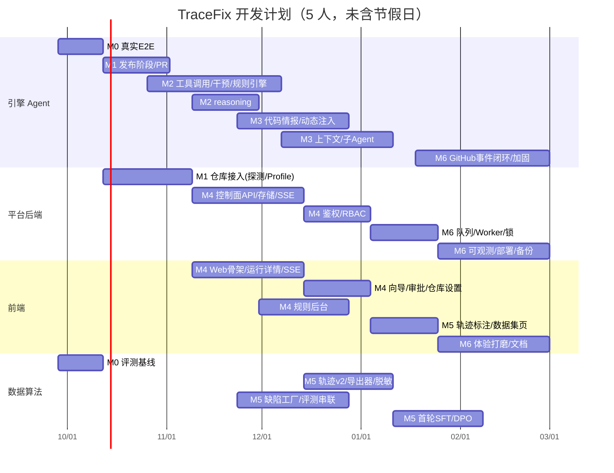

# 开发计划与里程碑

> ⚠️ **本版已被取代**（2026-09-25）。后续规划以同目录的[内部模型版](开发计划与里程碑-内部模型版.md)为准，前提为：
> - 使用公司内部模型，不做训练；
> - 编码模型负责决策，多模态模型作为看图工具；
> - 仓库按会话 / 任务配置（代码托管仍在 github.com）；
> - Run 累计 Usage 只计量；保留单次请求与工具交互保护、未知结果暂停核查。
>
> 本文件的排期、人周和目标仅作历史参考，不是当前已实现清单。2026-09-25 的 `82d74ca`、`f5cc31b` 仅交付 DeepSeek 类 Chat Completions 原生浏览器工具与重试恢复基础；后续已补充 Skill 的 name/description 索引、阶段触发器渐进式加载和版本哈希审计。通用 ToolSpec、Anthropic、自动能力矩阵及内部双模型方案仍未实现。工作区离线重点测试 85 项通过，不等同于干净 HEAD checkout 通过，也不代表真实 API/MCP E2E 完成。

## 1. 规划前提

- **工作量**：功能差距合计 81 人周，加 20% 缓冲约 97 人周（明细见 `00-项目进度/差距清单.md`）。
- **建议团队（5 人）**：Agent 引擎 ×2、平台后端 ×1、前端 ×1、数据 / 算法 ×1，周期约 **24 周**。4 人团队约 28 周；单人开发请看第 6 节的最小可行路径。
- **起始日期**：2026-09-28（周一）。排期**未扣除国庆和春节假期**，实际需要顺延约 2 周。
- **原则**：先打通真实闭环，再扩展能力；每个里程碑都有可以验证的验收标准，不达标不进入下一个依赖它的里程碑。

## 2. 里程碑总览

| 里程碑 | 周次 | 目标 | 阶段跃迁 | 关键验收 |
|---|---|---|---|---|
| **M0 真实闭环基线** | W1-W2 | 在真实环境中跑通现有主干 | L2 → L2+ | bugboard-target 至少 3 个缺陷在真实环境达到 `FIX_VERIFIED`；夜间 E2E CI 通过；测试 100% 通过 |
| **M1 交付闭环** | W3-W5 | GitHub 认证 → 发布阶段 → Draft PR；仓库接入 | → **L3 Alpha** | 在沙箱仓库上执行 `tracefix run --repo <url>`，全自动（含审批）生成 Draft PR |
| **M2 可控 Agent** | W5-W10 | 通用工具框架、分级干预、任务说明书、检测规则引擎、reasoning 策略；原生浏览器工具基础已有增量交付 | L3 | 规则强制注入可以在 request artifact 中验证；L1 提示在下一步生效；oracle 规则命中后生成 Finding |
| **M3 智能增强** | W9-W15 | 代码情报、动态注入、上下文组装与压缩、子 Agent 并行、DISCOVER | L3 | 评测集上定位准确率比 M0 基线提升 ≥ 20%；平均输入 token 下降 30%；超预算失败为 0 |
| **M4 Web 产品化** | W7-W16 | 独立的控制面 API + Web 应用 + 鉴权 / RBAC + 规则后台 + 审批中心 | → **L4 Beta** | 种子用户只用 Web（不用 CLI）完成「接入仓库 → PR」全流程 |
| **M5 数据引擎** | W12-W20 | 轨迹 v2、导出器、脱敏、标注、数据集版本、缺陷工厂、评测串联、首轮训练 | L4 | 数据集 v1（≥ 5000 条已授权样本）；学生模型在评测集上的报告 |
| **M6 企业级与 GA** | W17-W24 | 多租户、队列 / Worker 高可用、可观测性、部署、审计、安全评审、GitHub 事件闭环 | → **L5 / L6** | 达成 SLO；安全评审无高危问题；完成 2 个试点团队 |

## 3. 甘特图

## 4. 各里程碑明细

### M0 真实闭环基线（W1-W2）

| 任务 | 负责 | 产出 |
|---|---|---|
| 准备真实环境：Docker、Postgres、浏览器镜像，以及真实模型 key | 平台 | 可复用的 `compose` 环境 |
| 在 bugboard-target 的 12 个缺陷上跑真实 repair，记录成功率、失败分类、成本 | 引擎 + 数据 | 基线报告（后续所有优化都与它对比） |
| 夜间 E2E CI（Linux Runner + Docker） | 平台 | CI 工作流；`verification.json` 改为自动生成 |

**门禁**：如果真实环境的成功率低于 3/12，先在 M0 内定位原因（模型选择、提示词、快照截断、定位器等），再进入 M1。M2、M3 的优化都以这份基线为参照。

### M1 交付闭环（W3-W5）

- 引擎：`Phase.PUBLISH`、发布检出（保留历史）、`git apply --3way`、可配置的 commit 身份与 trailer、`RepoProvider`（GitHub REST）、PR 模板、发布审批、幂等（按 head 分支去重）。
- 平台：PAT（个人模式 keyring）、GitHub App 骨架、仓库探测与 Profile 草稿、命令审计的 CLI 交互、镜像缓存。
- 测试：假 GitHub 服务 + 本地 bare origin；夜间在沙箱仓库上真实创建 Draft PR 并自动关闭。

### M2 可控 Agent（W5-W10）

| 周 | 内容 |
|---|---|
| W5-W6 | 📐 通用 ToolSpec 注册表、提交类工具与后续协议适配；DeepSeek 类 Chat Completions 浏览器 function tools 已实现，JSON legacy 需显式配置，不做自动回退 |
| W6-W7 | Guidance（L1 / L2 / L3）+ CLI 的 `/hint`、`/constrain`、`/retarget` |
| W7-W8 | 规则实体与 RuleResolver；oracle：`console_no_error`、`network_status`、`dom_assertion`；guided 规则强制注入；Finding |
| W8-W9 | TaskBrief + PLAN + 计划确认；Job → 多 Run（先串行执行） |
| W9-W10 | 📐 按阶段制定 thinking 策略、评估 Anthropic 原生协议；CLI 子命令与 `--json` 输出。每次真实 usage 计量已实现，不再列为全新待交付能力 |

### M3 智能增强（W9-W15）

- 代码情报：多语言 tree-sitter、符号表 / 导入图、`code.ui_map`、source map 堆栈还原、LSP（可选）；SQLite 索引。
- 注入器：事件订阅、`code_insights` 预算、补丁预验证（tsc / eslint 增量）、StructuredEdit。
- 上下文：token 计数、分区预算、快照压缩与差分、compact、L1 / L2 记忆、prompt cache。
- 子 Agent：code-explorer 并行、patch-reviewer、DISCOVER 阶段的 gui-scout（带沙箱资源调度）。
- 每项都在评测集上做消融对比（开 / 关），结果写入评测报告。

### M4 Web 产品化（W7-W16）

- 后端：`tracefix serve`（Starlette），REST `/api/v1` + SSE，统一存储接口（Postgres / SQLite），替代 Node 桥接。
- 前端：独立的 `web/` 应用；按优先级依次实现：运行详情（实时 + 控制 + 干预 + 审批）→ 新建任务向导 → 仓库设置 → 审批中心 → 规则中心 → 工作台。
- 鉴权：OIDC / GitHub OAuth、API Token、RBAC 矩阵。
- `frontend/apps/web` 回归示例应用定位，清理遗留路由。

### M5 数据引擎（W12-W20）

- 轨迹 `tracefix.trajectory/2`、context_manifest、自动标签、真实截图脱敏（OCR 遮盖）。
- 导出器：`sft.action`（兼容现有格式）、`sft.agentic`、`sft.state`、`pref.dpo`、`rl.step`、`rl.episode`。
- 缺陷工厂：AST 变异算子，每个示例应用 × 每个算子生成 20-50 个有效缺陷；新增 2-4 个不同框架的示例应用。
- 评测：`evals/run.py` 串联，补齐 FLAKY / INFRA 对照用例和全部指标。
- 训练：独立的 lock 文件 + GPU Runner；首轮 SFT（agentic）与 DPO 实验；后续另行实现学生模型的原生工具策略接入并开展灰度验证。

### M6 企业级与 GA（W17-W24）

- 多租户 RLS、配额、队列与 Worker 高可用、跨进程锁、孤儿容器巡检。
- OTel、metrics、看板、告警；compose 全栈、Helm、备份与恢复演练。
- 审计哈希链、Vault、secret scanning、镜像签名、gVisor 选项、第三方安全评审。
- GitHub Webhook：Issue / PR 评论触发、评审意见续跑。
- 文档：快速开始、管理员手册、常见问题；两个试点团队的验收。

## 5. 风险

| 风险 | 概率 | 影响 | 应对 |
|---|---|---|---|
| 真实环境的修复成功率偏低（模型能力、GUI 定位） | 高 | 高 | M0 先摸清基线；诊断阶段优先接入代码情报；支持更换教师模型；场景从易到难排列 |
| 供应商的 thinking 与 JSON / 工具调用不兼容 | 中 | 中 | 后续设计能力验证与 thinking 配置；当前没有自动能力矩阵或自动协议回退，只有显式 JSON legacy；未知结果必须暂停核查 |
| 任意仓库接入复杂度过高 | 高 | 中 | 先支持 Node + Vite / Next / CRA 主流栈；其他栈要求手写 Profile |
| 沙箱资源不足导致并发低 | 中 | 中 | Worker 配额与排队；浏览器类子 Agent 默认关闭 |
| GitHub 速率限制和权限问题 | 中 | 低 | 使用 GitHub App；按 `Retry-After` 退避；发布幂等 |
| 训练数据授权不足 | 中 | 高 | 以缺陷工厂和公开仓库为主要数据来源；授权开关默认关闭 |
| 范围蔓延 | 高 | 高 | 每个里程碑设门禁；P2 项可以推迟到 GA 之后 |

## 6. 单人开发的最小可行路径（约 20-22 周）

资源只有 1 人时，只保留需求中的「核心叙事」闭环，按顺序推进：

1. **M0**：真实 E2E 基线（2 周，旧估算）。
2. **M1 精简版**：只支持 PAT 认证 + PUBLISH + Draft PR（2.5 周）。
3. **M2 精简版**：Guidance L1 / L2、三种 oracle 规则 + guided 规则注入、reasoning 采集（5 周）。
4. **数据最小集**：trajectory v2 + `sft.agentic` 导出器 + 评测串联（3 周）。
5. **Web 最小集**：在现有控制台中补上审批 / 暂停 / 取消 / 发布按钮、规则列表与编辑页、SSE 事件流（4 周）。
6. **上下文最小集**：token 计数 + 快照压缩 + 结构化摘要 compact（2 周）。
7. 其余能力（完整代码情报、子 Agent 并行、多租户、队列、Helm）作为后续规划。
